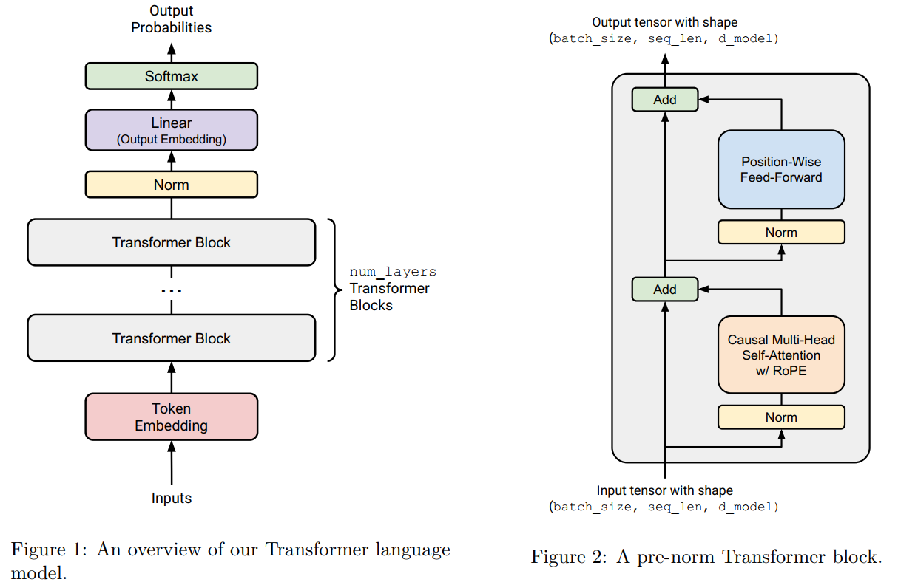
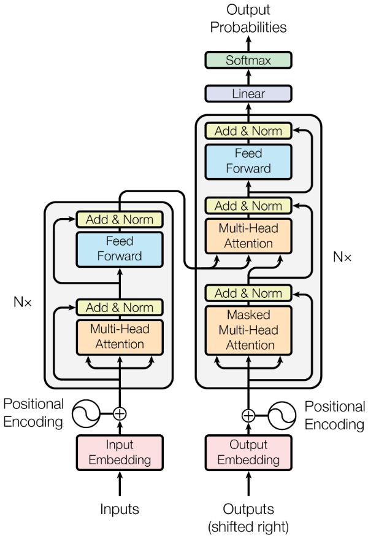

# Assignment 1 (basics): Building a Transformer LM

## 1 课程作业整体介绍

**你将实现的内容：**

1. **字节对编码（BPE）分词器**
   - 从头实现 BPE 算法，用于构建子词（subword）级别的分词器。
   - 在 TinyStories 数据集上训练该分词器。
   - 使用训练好的分词器将文本数据转换为整数 ID 序列，供模型训练使用。

2. **Transformer 语言模型**
   - 完全从头构建一个标准的 Transformer 架构语言模型（如 GPT 风格）。
   - 包括多头自注意力机制（Multi-Head Self-Attention）、前馈网络（Feed-Forward Network）、层归一化（Layer Normalization）、位置编码（Positional Encoding）等组件。
   - 不允许使用 torch.nn 中的层定义（如 Linear、Embedding、LayerNorm 等），但可以使用 torch.nn.Parameter 和容器类（如 Module、ModuleList、Sequential）。
  
3. **交叉熵损失函数与 AdamW 优化器**
   - 手动实现交叉熵损失函数（Cross-Entropy Loss），用于语言模型训练。
   - 从头实现 AdamW 优化器（包括动量、自适应学习率和权重衰减机制），不能使用 torch.optim 中的现成优化器（但可继承 torch.optim.Optimizer 基类）。

4. **支持序列化/加载的训练循环**
   - 实现完整的训练循环，支持：
     - 模型状态保存与加载（state_dict 的保存与恢复）
     - 优化器状态的保存与加载
     - 断点续训功能
   - 训练过程中记录损失、困惑度（perplexity）等指标。

**你将运行的任务：**

1. **在 TinyStories 数据集上训练 BPE 分词器**
   - 使用提供的 TinyStories 文本数据训练你实现的 BPE 分词器。

2. **将数据集转换为整数 ID 序列**
   - 使用训练好的 BPE 分词器对 TinyStories 数据进行编码，生成模型可处理的整数 token ID 序列。

3. **在 TinyStories 上训练 Transformer 语言模型**
   - 使用编码后的数据训练你实现的 Transformer 模型。
   - 训练期间监控训练损失，并在验证集上计算困惑度。

4. **生成样本与评估困惑度**
   - 使用训练好的模型进行文本生成（如通过自回归采样）。
   - 在验证集上计算并报告语言模型的困惑度（Perplexity）。

5. **在 OpenWebText 数据集上训练模型并提交结果**
   - 将模型应用于更大的 OpenWebText 数据集进行训练。
   - 在测试集上评估最终模型的困惑度，并将结果提交至课程指定的排行榜。

## 2 分词 (Tokenization)
### 2.1 Unicode标准
在本作业的第一部分，我们将实现并训练一个**字节级字节对编码（Byte-Pair Encoding, BPE）分词器**，该方法基于 Sennrich 等人（2016）和 Wang 等人（2019）的工作。与传统的基于字符或子词的 BPE 不同，我们将以**字节（byte）为基本单位**进行分词器的构建。

具体来说，我们会将任意 Unicode 字符串首先转换为对应的字节序列（使用 UTF-8 编码），然后在这个字节序列上运行 BPE 算法。这样做的好处是：
- 可以自然地处理所有 Unicode 字符（包括英文、中文、表情符号等），无需显式地维护庞大的词汇表；
- 模型具备开箱即用的多语言支持能力；
- 避免了未知词（OOV, out-of-vocabulary）问题，因为任何字符串都可以被编码为字节序列。

最终，该分词器能够将输入文本转换为整数 token ID 序列，供后续的 Transformer 语言模型训练使用。

**Unicode 与字节编码简介**
在 Python 中，字符串以 Unicode 形式存储。每个字符对应一个唯一的码点（code point），可以通过 ord() 函数获取其整数值，例如：
```python
ord('s')   # 输出: 115    
ord('牛')  # 输出: 29275
```
反之，使用 chr() 可以将码点转换回字符：
```python
chr(115)    # 输出: 's'    
chr(29275)  # 输出: '牛'
```
为了转换为字节序列，我们可以使用 UTF-8 编码：
```python
"Hello 😂".encode('utf-8')  # 输出: b'Hello \xf0\x9f\x98\x82'
```
这会返回一个字节序列（bytes 类型），其中每个元素是 0 到 255 之间的整数。BPE 分词器将在这样的字节序列上进行训练。

**问题（1分）**
(a) chr(0)返回什么Unicode字符？
```python
chr(0)  # 输出: '\x00'
```
(b) 该字符的字符串表示与打印表示有何不同？
(c) 当该字符出现在文本中会发生什么？
```python
l = "this is a test" + chr(0) + "string"
l  # 'this is a test\x00string'
print(l)  # 输出: this is a teststring
```

### 2.2 Unicode编码
尽管 Unicode 标准为每个字符定义了唯一的代码点（即一个整数），但直接在 Unicode 代码点上训练分词器并不可行。主要原因有两个：一是 Unicode 字符总数庞大（目前已定义的字符超过 15 万个），导致词汇表规模过大；二是大多数字符在实际文本中极为罕见，造成词汇表高度稀疏，不利于模型学习和泛化。

为解决这一问题，我们转而使用 Unicode 编码方案 将文本转换为字节序列，并在字节级别上构建分词器。Unicode 定义了多种编码格式，其中最常用的是 UTF-8、UTF-16 和 UTF-32。在这些编码中，UTF-8 是当前互联网上最主流的编码方式，据估计超过 98% 的网页都采用 UTF-8。

UTF-8 的一个重要特性是：它将每个 Unicode 字符编码为 1 到 4 个字节的序列（对于基本 ASCII 字符仅用 1 字节，而中文、表情符号等则使用 3 或 4 字节），兼容 ASCII 且可变长，高效且广泛支持。
```python
test_string = "hello! 天海!"
utf8_encoded = test_string.encode("utf-8")
print(utf8_encoded)  # 输出: b'hello! \xe5\xa4\xa9\xe6\xb5\xb7!'
print(type(utf8_encoded))  # 输出：<class 'bytes'>

# 拆解字节值（0-255整数）
list(utf8_encoded)  

# 验证可逆性
print(len(test_string), len(utf8_encoded))  # 输出: 10  14
print(utf8_encoded.decode("utf-8"))  # 输出: 'hello! 天海!'
```

**问题 (3 分)**
(a) 为什么我们更倾向于在UTF-8编码的字节上训练分词器，而不是UTF-16或UTF-32？比较这些编码对不同输入字符串的输出可能有所帮助。

我们更倾向用 UTF-8，因为它**字节为基本单位、与 ASCII 兼容且对英文/常见文本更省空间**：ASCII 字符在 UTF-8 中只占 1 字节，而 UTF-16 至少 2 字节、UTF-32 固定 4 字节，会让序列更长、训练和存储更低效。并且 UTF-16/32 的字节序与代理项等细节更复杂，用“字节级”BPE 时更容易引入实现与跨平台一致性问题。


(b) 考虑以下（错误的）函数，其目的是将UTF-8字节串解码为Unicode字符串。为什么这个函数是错误的？提供一个会产生错误结果的输入字节串示例。
```python
def decode_utf8_bytes_to_str_wrong(bytestring: bytes):
    return "".join([bytes([b]).decode("utf-8") for b in bytestring])
```
这个函数错在它把 UTF-8 的每个“字节”当成一个完整字符去单独解码。但 UTF-8 是变长编码，很多非 ASCII 字符会由 2–4 个字节共同组成；把它们拆开逐字节`decode("utf-8")`时，每个单独字节往往不是合法的 UTF-8 序列，会报错或得到错误结果。
```python
decode_utf8_bytes_to_str_wrong("hello".encode("utf-8"))
# decode_utf8_bytes_to_str_wrong("café".encode("utf-8")) 错误
```

### 2.3 子字标记化（subword tokenization）
虽然字节级标记化能够有效缓解单词级标记器面临的词汇表外问题，但将文本分解为单个字节会导致输入序列过长。例如，一个包含10个单词的句子在单词级模型中可能仅对应10个标记，而在字节级模型中却可能膨胀至50个甚至更多标记，具体取决于单词长度。这种扩展显著增加了模型每一步的计算量，拖慢训练速度。同时，过长的序列也给语言建模带来挑战，因为它在数据中引入了更复杂的长期依赖关系。

子字标记化（subword tokenization）则介于单词级和字节级之间，提供了一种折中方案。与仅有256个条目的字节级词汇表不同，子词标记器通过扩大词汇量来更高效地压缩原始字节序列。其核心思想是：如果某些字节序列（如 b'the'）在训练数据中频繁出现，就将其合并为一个单独的标记，从而将原本多个字节组成的序列压缩为一个单元。这样既能保持对罕见词和未知词的处理能力，又能显著缩短平均序列长度。

如何选择这些子词单元？Sennrich 等人（2016）提出采用字节对编码（Byte Pair Encoding, BPE），这是一种源自数据压缩技术的算法。BPE 通过迭代地查找并合并出现频率最高的相邻字节对，逐步构建出一组高效的子词单元。每次合并都会引入一个新的符号来代表该字节对，并将其加入词汇表。这一过程持续进行，直到达到预设的词汇表大小。由于BPE优先合并高频模式，因此最终的词汇表能最大程度地提升整体压缩效率——常见词或词片段更可能被表示为单一标记。

在本任务中，我们将实现一种基于字节的BPE分词器，其词汇项由原始字节及其合并后的序列表示。这种方法结合了字节级分词器的鲁棒性与子词级的高效性，在处理未登录词的同时保持合理的序列长度。整个构建词汇表的过程也被称为“训练”BPE分词器，是实现高效文本表示的关键步骤。

### 2.4 BPE分词器训练
BPE分词器的训练包含三个步骤：初始化、预分词和合并。

#### 2.4.1 词表初始化
首先进行词汇表的初始化，BPE分词器的词汇表本质上是一个从字节字符串到整数ID的一一映射。由于我们训练的是字节级BPE分词器，初始词汇表包含所有256个可能的字节值，因此初始大小为256。

#### 2.4.2 预分词
接下来是预分词阶段。理论上，我们可以直接在原始字节序列上统计相邻字节对的出现频率并开始合并，但这样每次合并都需要遍历整个语料库，计算成本极高。此外，若不加处理地跨文本合并字节，可能导致仅因标点不同而语义相近的词被拆分为完全不同的一组标记，例如“dog!”和“dog.”会被视为完全无关的标记，不利于模型学习其语义一致性。为缓解这一问题，我们先对语料进行预分词。预分词可以看作是对文本的一次粗粒度切分，有助于高效统计字节对的共现频率。例如，如果单词“text”作为预分词出现了10次，那么其中的字节对‘t’和‘e’的共现次数就可以一次性增加10次，而无需重复扫描整个语料。每个预分词以UTF-8编码的字节序列表示。

原始BPE实现中采用简单的空格分割`s.split(" ")`，而我们则采用GPT-2所使用的正则表达式预分词器（来自OpenAI的tiktoken项目），其模式为：`r"'(?:[sdmt]|ll|ve|re)| ?\p{L}+| ?\p{N}+| ?[^\s\p{L}\p{N}]+|\s+(?!\S)|\s+"`。例如对句子“some text that i'll pre-tokenize”进行切分，结果为：['some', ' text', ' that', ' i', "'ll", ' pre', '-', 'tokenize']。在实际编码中，建议使用`re.finditer`而非`re.findall`，以便在构建预分词频次映射时避免额外存储中间列表。

#### 2.4.3 BPE合并计算
完成预分词后，进入BPE合并的计算阶段。此时，每个预分词已被表示为字节序列，算法开始迭代地统计所有相邻字节对的出现频率，并选择频率最高的字节对进行合并。例如，若字节对（A, B）是当前最频繁的组合，则将所有连续出现的A和B替换为一个新的合并标记“AB”，并将该新标记加入词汇表。由于初始词汇表大小为256，最终词汇表的大小等于256加上训练过程中执行的合并操作数量。为了提升效率，在统计字节对时不会跨越预分词边界进行合并。当多个字节对频率相同时，采用字典序较大的那一对作为胜出者。例如，若（"A", "B"）、（"A", "C"）、（"B", "ZZ"）和（"BA", "A"）频率相同，则选择**字典序最大**的（"BA", "A"）进行合并。

此外，某些特殊字符串用于表示元信息，例如文档边界或序列结束。这类字符串应作为“特殊标记”被整体保留，绝不允许被拆分。因此，这些特殊标记必须提前加入词汇表，并分配固定的ID。例如表示序列结束的字符串，必须始终对应单一标记，以便模型在生成文本时能准确判断何时停止。Sennrich等人（2016）的原始论文中给出了BPE训练的非优化版本，适合初学者实现以理解基本流程。

以论文中的示例说明：假设语料包含以下文本：
```
low low low low low    
lower lower widest widest widest    
newest newest newest newest newest newest    
```
并设定<|endoftext|>为特殊标记。初始词汇表包括<|endoftext|>和全部256个字节。

预分词采用空格分割，得到频次统计：low（5次）、lower（2次）、widest（3次）、newest（6次），可表示为字节元组的频数字典，如{(b'l', b'o', b'w'): 5, ...}。随后统计所有相邻字节对的频率：lo（7次）、ow（7次）、we（8次）、er（2次）、wi（3次）、id（3次）、de（3次）、es（9次）、st（9次）、ne（6次）、ew（6次）。其中（es）和（st）频率最高且相同，按字典序选择更大的（st）进行合并。于是，所有包含“st”的词如“widest”和“newest”中的“s”和“t”被合并为新标记“st”。第二轮中，“e”与“st”组合出现9次，成为最高频对，合并为“est”。继续此过程，后续合并依次为“ow”、“low”、“west”、“ne”等。若仅执行6次合并，最终新增标记为['s t', 'e st', 'o w', 'l ow', 'w est', 'n e']。更新计算后的词汇表如下所示。
```
[<|endoftext|>, [...256 BYTE CHARS], st, est, ow, low, west, ne]
```
此时，“newest”将被切分为[ne, west]两个标记。这一机制在保持对未知词处理能力的同时，有效压缩了序列长度，提升了模型效率。

### 2.5 BPE分词器训练实验
现在我们在 TinyStories 数据集上训练字节级 BPE 分词器。
https://huggingface.co/datasets/roneneldan/TinyStories/tree/main

**并行化预分词**
预分词是主要性能瓶颈，可使用 multiprocessing 库进行并行加速。建议在确保分块边界位于特殊 token 起始位置的前提下对语料分块。可参考以下链接中的示例代码获取分块边界，用于跨进程任务分配：https://github.com/stanford-cs336/assignment1-basics/blob/main/cs336_basics/pretokenization_example.py%E3%80%82

该分块方式始终有效，因为我们不会在文档边界执行合并操作。本作业中可始终采用此方法，无需考虑极端情况（如超大语料中不含标记的情形）。

**预分词前移除特殊token**
在使用正则表达式`re.finditer`进行预分词前，应先从语料（或分块）中移除所有特殊 token。必须确保在特殊 token 处分割文本，防止跨文档合并。例如，对于 [文档1] [文档2] 的语料，应在 处分割，分别对两部分进行预分词。可通过`re.split`实现，使用`"|".join(special_tokens)`作为分隔符（注意使用`re.escape`处理特殊字符，避免`|`等符号引发问题）。

**优化合并步骤**
朴素的 BPE 训练实现效率较低，因每次合并后需重新遍历所有字节对以找最高频对。实际上，仅与被合并字节对相邻的计数会发生变化。因此，可通过维护字节对计数的索引结构，并在每次合并后增量更新相关计数，显著提升速度。尽管该缓存机制能大幅加速，但 BPE 合并步骤在 Python 中无法并行化。

**低资源/降级提示：性能分析**
建议使用 cProfile 或 scalene 等工具进行性能分析，定位瓶颈并集中优化关键部分。

**低资源/降级提示：降级训练**
不要直接在完整 TinyStories 数据集上训练。建议先在小规模子集（“调试数据集”）上实验，例如使用包含 2.2 万篇文档的验证集（而非完整的 212 万篇）。这是一种通用开发策略：通过使用更小数据、更小模型来加速迭代。选择调试集规模和超参数时需权衡：应足够大以复现真实瓶颈，又不宜过大导致耗时过长。

**问题（15分）BPE 分词器训练**
交付要求：编写一个函数，根据输入的文本文件路径训练（字节级）BPE分词器。你的BPE训练函数应至少处理以下输入参数：
- input_path: str BPE分词器训练数据文本文件的路径。
- vocab_size: int 定义最终词汇表最大大小的正整数（包括初始字节词汇表、合并产生的词汇表项和任何特殊token）。
- special_tokens: list[str] 需要添加到词汇表中的字符串列表。这些特殊token不会影响BPE训练过程。

你的BPE训练函数应返回最终的词汇表和合并记录：
- vocab: dict[int, bytes] 分词器词汇表，一个从整数（词汇表中的token ID）到字节（token字节）的映射。
- merges: list[tuple[bytes, bytes]] 训练产生的BPE合并记录列表。每个列表项是一个字节元组(, )，表示与被合并。
  
代码可见[hw1_1bpe_tokenzier_train.py](hw1/hw1_1bpe_tokenzier_train.py)

**问题（2 分）TinyStories 的 BPE 训练**
(1) 在 TinyStories 数据集上训练一个字节级 BPE 分词器，最大词汇表大小为 10,000。确保将 TinyStories 的 </s> 特殊标记加入词汇表。将生成的词汇表和合并规则序列化保存到磁盘以便进一步检查。训练耗时多少小时，占用多少内存？词汇表中最长的 token 是什么？这合理吗？
资源要求：≤ 30 分钟（不使用 GPU），≤ 30GB 内存
提示：通过在预分词阶段使用多进程，并结合以下两个事实，你应该能在 2 分钟内完成 BPE 训练：
(a) 数据文件中使用 </s> 标记来分隔文档。
(b) </s> 标记在应用 BPE 合并之前已被作为特殊情况处理。
交付内容：一到两句话的回复。
(2) 对你的代码进行性能分析。分词器训练过程中哪一部分耗时最长？
交付内容：一到两句话的回复。

### 2.6 BPE分词器训练实验
在作业的前一部分中，我们实现了一个函数，用于在输入文本上训练 BPE 分词器，以获得分词器词汇表和 BPE 合并列表。现在，我们将实现一个 BPE 分词器，它加载提供的词汇表和合并列表，并使用它们对文本进行编码和解码到标记 ID 或从标记 ID 中进行编码和解码。

#### 2.6.1 对文本进行编码
BPE 对文本进行编码的过程反映了我们训练 BPE 词汇的方式。整个过程可分为以下几个主要步骤：

**第1步：预分词化（Pre-tokenization）**
我们首先使用预分词器（pre-tokenizer）将输入文本切分为“预分词”（pre-tokens）。常见的策略是按空格或标点切分，但保留边界信息（例如，将空格作为下一个词的前缀）。每个预分词将被独立处理。

然后，我们将每个预分词转换为其对应的 UTF-8 字节序列（bytes），作为后续合并操作的基本单位。
```
🔍 示例：字符串 'the cat ate' 被切分为 ['the', ' cat', ' ate']，每个元素都以字节形式表示。
```

**第2步：应用 BPE 合并规则**
对于每个预分词，我们将其初始字节序列按照训练阶段学到的合并规则列表（merges）逐步合并。合并顺序至关重要——必须严格按照训练时产生的顺序依次尝试。

每次查找当前序列中是否存在可应用的合并对（相邻且完全匹配）
若存在，则执行合并，生成更长的子词单元
重复此过程，直到无法再应用任何规则
⚠️ 注意：合并不会跨越预分词边界。也就是说，不同预分词之间的字节不会被合并，保证了分词的局部性与可预测性。

**第3步：映射为 Token ID**
当每个预分词完成所有可能的合并后，得到一组最终的子词单元（subword units）。我们通过查表的方式，将这些子词单元映射为词汇表中的整数 ID，形成最终的 token ID 序列。

#### 2.6.2 详细案例解析：'the cat ate' 的完整编码过程
为了更深入理解上述流程，下面我们对输入字符串 'the cat ate' 进行端到端的 BPE 编码演示。

**输入信息**
- 输入字符串：'the cat ate'
- 词汇表（Vocabulary）：
  ```   
  0: b' ',     # 空格    
  1: b'a',    
  2: b'c',    
  3: b'e',    
  4: b'h',    
  5: b't',    
  6: b'th',    
  7: b' c',   # 空格 + c    
  8: b' a',   # 空格 + a    
  9: b'the',    
  10: b' at'   # 空格 + a + t    
  ```
- 合并规则（Merges）（按优先级顺序）：
  ```  
  (b't', b'h'),      # → b'th'    
  (b' ', b'c'),      # → b' c'    
  (b' ', b'a'),      # → b' a'    
  (b'th', b'e'),     # → b'the'    
  (b' a', b't')      # → b' at'    
  ```
- 预分词策略：按空格分割，空格归属于后续词（即作为前缀）

**步骤一：预分词（Pre-tokenization）**
原始字符串：'the cat ate'
切分结果：
```
['the', ' cat', ' ate']
```
解释：
- 'the'：无前导空格
- ' cat'：包含前导空格
- ' ate'：包含前导空格

💡 此策略影响后续合并行为，因为空格被视为字符的一部分。

**步骤二：逐个预分词应用 BPE 合并**
✅ 预分词 1: 'the'
1. 初始分解：[b't', b'h', b'e']
2. 应用合并：
   - (b't', b'h') → 合并为 [b'th', b'e']
   - (b'th', b'e') → 合并为 [b'the']
3. 查表得 ID：b'the' → ID 9
4. 输出：[9]
✅ 完成。

✅ 预分词 2: ' cat'
1. 初始分解：[b' ', b'c', b'a', b't']
2. 应用合并：
   - (b' ', b'c') → 合并为 [b' c', b'a', b't']
   - 其他规则无法应用：
     - (b' ', b'a')：当前没有独立的 b' ' 和 b'a' 相邻
     - (b' a', b't')：需要 b' a'，但此处是 b'a' 且前接 b' c'
3. 查表得 ID：
   - b' c' → 7
   - b'a' → 1
   - b't' → 5
4. 输出：[7, 1, 5]
✅ 完成。

✅ 预分词 3: ' ate'
1. 初始分解：[b' ', b'a', b't', b'e']
2. 应用合并：
   - (b' ', b'a') → 合并为 [b' a', b't', b'e']
   - (b' a', b't') → 合并为 [b' at', b'e']
3. 查表得 ID：
   - b' at' → 10
   - b'e' → 3
4. 输出：[10, 3]
✅ 完成。

**步骤三：拼接所有 token ID**
将各预分词的编码结果串联：
- 'the' → [9]
- ' cat' → [7, 1, 5]
- ' ate' → [10, 3]
最终编码结果：
```
[9, 7, 1, 5, 10, 3]
```

#### 2.6.3 关键要点总结
| 要点 | 说明 |
|  ---- | ---- |
| 🔁 合并顺序决定结果 | 必须严格按照训练时生成的顺序尝试合并，顺序不同可能导致不同输出 |
| 🚫 不跨预分词边界合并 | 即使两个预分词末尾和开头可以合并（如 'the' 和 ' cat' 中的 'e' 和 ' '），也不会发生跨词合并 |
| ⚠️ 上下文敏感性 | 相同字符组合因上下文不同可能被不同编码（如 'at' 在 'cat' 和 ' at' 中表现不同） |
| 🧩 空格处理方式至关重要 | 是否保留、作为前缀/后缀，直接影响合并路径 |
| 📇 词汇表完整性 | 所有合并后的子词必须存在于词汇表中，否则无法映射为 ID |

#### 2.6.4 解码：从 Token ID 到文本
编码的逆过程称为解码（Decoding），即将 token ID 序列还原为原始文本。

解码步骤：
1. 查表反向映射：将每个 ID 转换回对应的字节串（如 9 → b'the'）
2. 拼接字节串：按顺序连接所有字节
3. 解码为字符串：将拼接后的字节序列用 UTF-8 解码为 Unicode 字符串
4. 处理空格规范化（可选）：根据需要去除多余空格或调整格式

示例：解码 [9, 7, 1, 5, 10, 3]
1. 查表：
   - 9 → b'the'
   - 7 → b' c'
   - 1 → b'a'
   - 5 → b't'
   - 10 → b' at'
   - 3 → b'e'
2. 拼接字节：
```
b'the' + b' c' + b'a' + b't' + b' at' + b'e'
```

**问题（15分）实现分词器**
可交付成果：实现一个 Tokenizer 类，该类在给定词汇表和合并列表的情况下，将文本编码为整数 ID，并将整数 ID 解码为文本。分词器还应支持用户提供的特殊令牌（如果词汇表尚不存在，则将其附加到词汇表中）。我们推荐以下界面：

`def __init__(self, vocab, merges, special_tokens=None)`
根据给定的词汇表、合并规则列表以及（可选的）特殊标记列表构建一个分词器。该函数应接受以下参数：
- vocab: 一个从整数 ID 映射到字节串的字典（dict[int, bytes]）
- merges: 一个包含字节对元组的列表，表示 BPE 合并规则（list[tuple[bytes, bytes]]）
- special_tokens: 一个字符串列表，表示特殊标记，可选（list[str] | None = None）

`def from_files(cls, vocab_filepath, merges_filepath, special_tokens=None)`
一个类方法，用于从序列化的词汇表文件和合并规则文件（格式与你训练 BPE 代码输出的格式相同）构建并返回一个 Tokenizer，同时可选地接收一个特殊标记列表。该方法应接受以下额外参数：
- vocab_filepath: 词汇表文件的路径（str）
- merges_filepath: 合并规则文件的路径（str）
- special_tokens: 一个字符串列表，表示特殊标记，可选（list[str] | None = None）

`def encode(self, text: str) -> list[int]`
将输入文本编码为一个 token ID 序列。

`def encode_iterable(self, iterable: Iterable[str]) -> Iterator[int]`
给定一个字符串的可迭代对象（例如，一个 Python 文件句柄），返回一个生成器，惰性地逐个生成 token ID。这对于内存受限情况下对大型文件进行高效分词是必需的。

`def decode(self, ids: list[int]) -> str`
将一个 token ID 序列解码为原始文本。要使用我们提供的测试用例验证你的 Tokenizer 实现，你需要先实现 [adapters.get_tokenizer] 中的测试适配器，然后运行 uv run pytest tests/test_tokenizer.py。你的实现应能通过所有测试。

代码可见[hw1_2_implementing_the_tokenizer.py](hw2/hw1_2_implementing_the_tokenizer.py)


## 3 Transformer 语言模型架构
一个语言模型接收一批整数形式的标记ID序列作为输入（即，形状为 (batch_size, sequence_length) 的 torch.Tensor），并返回一个（批处理的）在词汇表上的归一化概率分布（即，形状为 (batch_size, sequence_length, vocab_size) 的 PyTorch Tensor），其中预测的分布是针对每个输入标记的下一个词。在训练语言模型时，我们使用这些对下一个词的预测，计算实际下一个词与预测下一个词之间的交叉熵损失。在推理阶段生成文本时，我们使用前馈网络最后一步（即序列中的最后一个时间步）预测的下一个词分布来生成序列中的下一个标记（例如，选择概率最高的标记，或从分布中采样等），将生成的标记添加到输入序列中，然后重复此过程。


在本作业的这一部分，你将从零开始构建这个Transformer语言模型。我们首先会给出模型的高级概述，然后再逐步详细介绍各个组成部分。

### 3.1 Transformer 语言模型
给定一个标记ID序列，Transformer语言模型首先使用输入嵌入（input embedding）将标记ID转换为稠密向量，然后将这些嵌入后的标记依次通过 num_layers 个 Transformer 块进行处理，最后应用一个可学习的线性投影（称为“输出嵌入”或“语言模型头”，即 LM head），生成预测的下一个标记的 logits。


#### 3.1.1 词元嵌入
在第一步中，Transformer 将（批处理的）标记ID序列嵌入为一系列向量，这些向量包含标记本身的信息（如图中的红色块所示）。
更具体地说，给定一个标记ID序列，Transformer 语言模型使用一个词元嵌入层（token embedding layer）生成一个向量序列。每个嵌入层接收一个形状为 (batch_size, sequence_length) 的整数张量，并输出一个形状为 (batch_size, sequence_length, d_model) 的向量序列。

#### 3.1.2 预归一化 Transformer 块
嵌入之后，激活值会经过多个结构相同的神经网络层进行处理。一个标准的 decoder-only Transformer 语言模型由 num_layers 个相同的层（通常称为 Transformer “块”）组成。
每个 Transformer 块接收一个形状为 (batch_size, sequence_length, d_model) 的输入，并输出一个相同形状的张量 (batch_size, sequence_length, d_model)。每个块通过自注意力机制在序列中聚合信息，并通过前馈网络层对其进行非线性变换。

### 3.2 输出归一化与嵌入
经过 num_layers 个 Transformer 块处理后，我们将获取最终的激活值，并将其转换为词汇表上的概率分布。

我们将实现“预归一化”（pre-norm）Transformer块（详见第3.5节），这种结构额外要求在最后一个Transformer块之后使用层归一化（Layer Normalization，详见下文），以确保输出具有适当的尺度。

在此归一化之后，我们将使用一个标准的可学习线性变换，将 Transformer 块的输出转换为预测的下一个标记的 logits，参见例如 Radford 等 [2018] 的公式2，如下所示:
$$\mathrm{FFN}(x) = \max(0, xW_1 + b_1)\,W_2 + b_2.$$

### 3.3 备注：批处理、Einsum 与高效计算
在整个 Transformer 模型中，我们会对许多类似批次的输入执行相同的计算。以下是一些例子：
- 批次中的元素：我们对每个批次中的样本都应用相同的 Transformer 前向操作。
- 序列长度：像 RMSNorm 和前馈网络这样的“逐位置”（position-wise）操作，在序列的每个位置上都以相同方式执行。
- 注意力头：在“多头注意力”机制中，注意力操作会在多个注意力头之间进行批处理。

因此，我们需要一种使用方便且高效的方式来执行这些操作，既能充分利用 GPU 的并行计算能力，又便于阅读和理解。许多 PyTorch 操作可以接受张量前端额外的“类批次”维度，并高效地在这些维度上重复或广播操作。

例如，假设我们要执行一个逐位置的批处理操作。我们有一个数据张量 D，其形状为 (batch_size, sequence_length, d_model)，并希望将其与一个形状为 (d_model, d_model) 的矩阵 A 进行批量向量-矩阵乘法。在这种情况下，D @ A 会自动执行批量矩阵乘法，这是 PyTorch 中一种高效的原语操作，其中 (batch_size, sequence_length) 维度被视为批处理维度。

正因为如此，最好假设你的函数可能会接收到额外的类批次维度，并始终将这些维度保留在 PyTorch 张量形状的最前面。为了组织张量以便能够以这种方式进行批处理，可能需要多次使用 view、reshape 和 transpose 操作来调整形状。这可能会比较繁琐，也常常导致代码难以阅读，且难以追踪张量的实际形状。

更便捷的选择是使用 torch.einsum 中的 einsum 记法，或采用框架无关的库如 einops 或 einx。两个核心操作是：
- **einsum**：可对任意维度的张量进行缩并（tensor contraction）；
- **rearrange**：可重新排列、拼接或分割张量维度。

事实上，机器学习中的大多数操作都可以归结为**维度变换**和**张量缩并**，外加偶尔的（通常是逐元素的）非线性函数。这意味着使用 einsum 记法可使代码更清晰、灵活。

我们强烈建议在课程中学习并使用 einsum 记法：

初学者请使用 einopshttps://einops.rocks/1-einops-basics/%EF%BC%9B
熟悉 einops 的同学可进一步学习更通用的 einx。

以下是一些使用 einsum 记法的示例，作为 einops 文档的补充。

```python
import torch
from einops import rearrange, einsum
```

计算张量 D（形状 [batch, seq, d_in]）和矩阵 A（形状 [d_out, d_in]）的乘积，结果应为 [batch, seq, d_out]。
1. **基础方法**：@ 运算符直接计算，需手动转置 A
2. **显式维度**：einops 第一种写法明确命名所有维度（如 batch seq d_in），可读性最佳
3. **省略号语法**：... d_in 自动匹配前置维度，适合高维张量（如后续的多头注意力案例）

验证部分通过 `torch.allclose` 确认所有方法数值等价。最后扩展展示了多头注意力场景，其中 ... 语法能优雅处理 [batch, heads, seq, dim] 的复杂维度，避免了繁琐的维度命名。einops 的优势在于：**维度意图更直观**，且省略号写法**泛用性更强**，特别适合深度学习中的高维张量操作。

```python
# 设定随机种子保证可复现性
torch.manual_seed(42)

# 定义输入张量
batch_size = 3
seq_len = 5
d_in = 4
d_out = 2

# 创建测试数据
D = torch.randn(batch_size, seq_len, d_in)  # 形状: [batch, sequence, d_in]
A = torch.randn(d_out, d_in)                # 形状: [d_out, d_in]

# 方法1: 使用普通矩阵乘法 @
Y_matmul = D @ A.T                          # A.T形状变为 [d_in, d_out]
print("矩阵乘法结果形状:", Y_matmul.shape)  # 输出: [batch, sequence, d_out]

# 方法2: 使用torch.einsum
Y_torch = torch.einsum("b s i, o i -> b s o", D, A)
print("torch.einsum结果形状:", Y_torch.shape)

# 方法3: 使用einops.einsum (第一种形式)
Y_einops1 = einsum(D, A, "batch seq d_in, d_out d_in -> batch seq d_out")
print("einops形式1结果形状:", Y_einops1.shape)

# 方法4: 使用einops.einsum (第二种形式，使用...)
Y_einops2 = einsum(D, A, "... d_in, d_out d_in -> ... d_out")
print("einops形式2结果形状:", Y_einops2.shape)
```
矩阵乘法结果形状: torch.size([3, 5, 2])
torch.einsum结果形状: torch.size([3, 5, 2])
einops形式1结果形状: torch.size([3, 5, 2])
einops形式2结果形状: torch.size([3, 5, 2])

```python
import torch
from einops import rearrange, einsum

# 示例（einstein_example2）：使用 einops.rearrange 进行广播操作

# 生成一批图像和一组缩放因子
images = torch.randn(64, 128, 128, 3)  # (batch, height, width, channel)，表示 64 张 128x128 的 RGB 图像
dim_by = torch.linspace(start=0.0, end=1.0, steps=10)  # (10,)，生成 10 个从 0 到 1 的亮度缩放因子

print("输入张量形状:")
print("images.shape:", images.shape)        # torch.Size([64, 128, 128, 3])
print("dim_by.shape:", dim_by.shape)        # torch.Size([10])

# 方法 1：通过 reshape 和乘法实现广播
dim_value = rearrange(dim_by, "dim_value -> 1 dim_value 1 1 1")  # 扩展为 (1, 10, 1, 1, 1)
images_rearr = rearrange(images, "b height width channel -> b 1 height width channel")  # (64, 1, 128, 128, 3)
dimmed_images_v1 = images_rearr * dim_value  # 广播相乘
print("\n方法1结果:")
print("dim_value.shape:", dim_value.shape)           # torch.Size([1, 10, 1, 1, 1])
print("images_rearr.shape:", images_rearr.shape)     # torch.Size([64, 1, 128, 128, 3])
print("dimmed_images_v1.shape:", dimmed_images_v1.shape)  # torch.Size([64, 10, 128, 128, 3])

# 方法 2：使用 einsum 一步完成
dimmed_images_v2 = einsum(
    images, dim_by,
    "batch height width channel, dim_value -> batch dim_value height width channel"
)

print("\n方法2结果:")
print("dimmed_images_v2.shape:", dimmed_images_v2.shape)  # torch.Size([64, 10, 128, 128, 3])
```
输入张量形状:
images.shape: torch.Size([64, 128, 128, 3])
dim_by.shape: torch.Size([10])

方法1结果:
dim_value.shape: torch.Size([1, 10, 1, 1, 1])
images_rearr.shape: torch.Size([64, 1, 128, 128, 3])
dimmed_images_v1.shape: torch.Size([64, 10, 128, 128, 3])

方法2结果:
dimmed_images_v2.shape: torch.Size([64, 10, 128, 128, 3])

### 3.4 基本构建模块：线性层和嵌入层
#### 3.4.1 参数初始化
正确的参数初始化非常重要。我们采用以下初始化规则：
- **线性层权重**：$W_{ij} \sim \mathcal{N}(0,\sigma^2)$，其中 $\sigma^2=\frac{2}{d_{\text{in}}+d_{\text{out}}}$，并截断至 $\pm 3\sigma$ 范围内。
- **嵌入层（Embeddings）**：每个元素从 $\mathcal{N}(0,1)$ 中采样，并截断到区间 $[-3,3]$。
- **RMSNorm 缩放参数（gains）**：全部初始化为1。

在 PyTorch 中，可以使用 `torch.nn.init.trunc_normal_` 来初始化权重。

#### 3.4.2 线性模块（Linear Module）
线性模块执行矩阵乘法操作。我们实现一个自定义的 Linear 类（继承自 `torch.nn.Module`），不包含偏置项。其前向传播计算为：
$$y=Wx,$$

```python
import torch
import torch.nn as nn
input_dim = 16384
hidden_dim = 32
w = nn.Parameter(torch.randn(input_dim,hidden_dim))
x = nn.Parameter(torch.randn(input_dim))
output = x @ w
output
```
tensor([ 285.3951,  210.2427,   34.5771,  -46.3320,   95.1141, -115.6904,
        -154.2949,  -60.1955,   50.3835,  228.9332, -253.0125,  183.3314,
        -226.0321,  -34.4998,   98.7434, -162.0564, -116.2524,  182.7540,
         -36.6848,   -2.1386,   46.6291,  220.2971, -149.2908,  -96.5421,
         -56.3646,    7.7230,    9.7287,  172.0354,  124.5273,  120.1974,
         204.0635, -156.1456], grad_fn=<SqueezeBackward4>)

```python
import numpy as np
w = nn.Parameter(torch.randn(input_dim,hidden_dim) / np.sqrt(input_dim))
output = x @ w
output
```
tensor([-1.1294,  0.0739, -0.0756, -1.2595,  0.1013,  0.4984,  0.4841, -0.3894,
        -0.8523,  0.5237, -0.3436,  0.5862, -0.0189, -0.2259, -0.7464, -0.1600,
        -0.0633,  1.0717, -1.0403, -1.0870, -0.1722, -0.2335, -0.3526, -1.3660,
         1.1142,  1.1098,  0.9295, -0.8007, -0.7902, -0.7361,  1.3478, -0.2251],
       grad_fn=<SqueezeBackward4>)

**问题（1分）实现线性模块**
交付内容：实现一个继承自 torch.nn.Module 的 Linear 类，执行线性变换。你的实现应遵循 PyTorch 内置的 nn.Linear 模块的接口，但不需要支持 bias（偏置）参数。
我们推荐以下接口：
`def __init__(self, in_features, out_features, device=None, dtype=None)`
构造一个线性变换模块。该函数应接受以下参数：
- in_features: int，输入张量的最后一个维度大小
- out_features: int，输出张量的最后一个维度大小
- device: torch.device | None = None，用于存储参数的设备
- dtype: torch.dtype | None = None，参数的数据类型

`def forward(self, x: torch.Tensor) -> torch.Tensor`
对输入 x 应用线性变换并返回结果。
注意事项：
- 必须继承 nn.Module
- 在 `__init__` 中调用父类构造函数（即 `super().__init__()`）
- 创建并存储你的权重参数 W（注意：是 W 而不是 W⊤，出于内存布局的考虑），并将 W 包装为 `nn.Parameter`
- 不能使用 `nn.Linear` 或 `nn.functional.linear`
- 权重初始化：使用 `torch.nn.init.trunc_normal_` 函数进行初始化

代码可见[linear_and_embedding_module.py](hw3/linear_and_embedding_module.py)

#### 3.4.3 嵌入模块（Embedding Module）
如上所述，Transformer 的第一层是一个嵌入层（embedding layer），它将整数形式的 token ID 映射到维度为 d_model 的向量空间。我们将实现一个自定义的 Embedding 类，该类继承自 `torch.nn.Module`（因此你不应使用 nn.Embedding）。其 forward 方法应通过在一个形状为（vocab_size, d_model）的嵌入矩阵中，使用形状为（batch_size, sequence_length）的 torch.LongTensor 类型的 token ID 进行索引，来为每个 token ID 选择对应的嵌入向量。

**问题（1分）实现嵌入模块**
交付内容：实现一个名为 Embedding 的类，该类继承自 `torch.nn.Module`，并执行嵌入查找操作。你的实现应当遵循 PyTorch 内置的 nn.Embedding 模块的接口。我们推荐使用以下接口：

`def __init__(self, num_embeddings, embedding_dim, device=None, dtype=None)`
构造一个嵌入模块。该函数应接受以下参数：
- num_embeddings: int，词汇表的大小
- embedding_dim: int，嵌入向量的维度，即 d_model
- device: torch.device | None = None，参数存储的设备
- dtype: torch.dtype | None = None，参数的数据类型

`def forward(self, token_ids: torch.Tensor) -> torch.Tensor`
对给定的 token ID 查找对应的嵌入向量。
注意事项：
- 必须继承 nn.Module 类
- 必须调用父类（超类）的构造函数
- 将嵌入矩阵初始化为 nn.Parameter
- 嵌入矩阵的形状应为 (num_embeddings, embedding_dim)，即 embedding_dim 是最后一个维度
- 不能使用 `nn.Embedding` 或 `nn.functional.embedding`
- 权重初始化请使用 `torch.nn.init.trunc_normal_`（截断正态分布初始化），并使用上述推荐的参数设置

代码可见[linear_and_embedding_module.py](hw3/linear_and_embedding_module.py)


