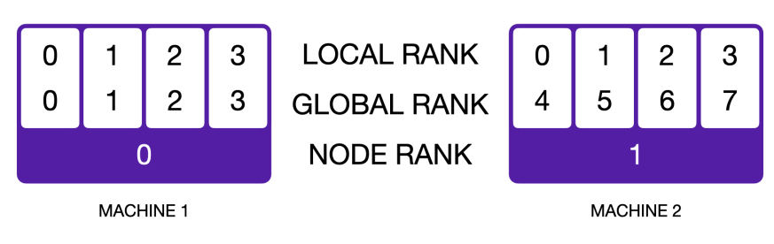

# Assignment 2 (systems): Systems and Parallelism

## 1 课程作业整体介绍

**你将实现的内容：**

1. **基准测试与性能分析工具**
2. **Flash Attention 2 Triton 内核**
3. **分布式数据并行训练**
4. **优化器状态分片**

在作业的第一部分，我们将学习如何优化 Transformer 模型性能，以充分利用 GPU 资源。会先对模型进行性能分析，了解其在正向传播和反向传播过程中时间与内存的消耗分布，然后通过自定义 GPU 内核优化自注意力机制，使其比 PyTorch 的原生实现更快。在作业的后续部分，我们将进一步探索多 GPU 训练方案。

### 1.1 性能分析与基准测试
在进行任何优化之前，先对程序进行性能分析至关重要——这能帮助我们了解资源（如时间和内存）在各个部分的消耗情况。否则，我们可能会耗费精力优化那些对整体性能影响甚微的模块，最终无法实现可量化的端到端性能提升。

我们将实现三种性能评估方式：（a）使用 Python 标准库进行简单的端到端基准测试，计时正向传播和反向传播过程；（b）借助 NVIDIA Nsight Systems 工具分析计算性能，了解时间在 CPU 和 GPU 各项操作中的分布；（c）分析内存使用情况。

#### 1.1.1 环境配置——导入基础 Transformer 模型
首先确保你能加载上一次作业实现的模型。上一次作业中，我们将模型封装为 Python 包，以便后续导入使用。我们已在 `./cs336-basics` 文件夹中提供了该模型的官方实现，并在 `pyproject.toml` 文件中配置了相关路径。与往常一样，通过 `uv run [command]` 命令运行代码时，uv 会自动定位这个本地的 `cs336-basics` 包。若你想使用自己实现的模型，可修改 `pyproject.toml` 文件，使其指向你的自定义包。

#### 1.1.2 模型规模定义
在本次作业中，我们将通过基准测试和性能分析不同规模的模型，以更好地理解性能变化规律。为了直观感受规模对性能的影响，我们将使用以下模型配置。所有模型的词汇表大小均为 10,000，批量大小（batch size）为 4，仅上下文长度（context length）不同。本次作业（及后续作业）需要呈现大量表格形式的结果，我们强烈建议你通过代码自动生成报告中的表格——因为手动用 LaTeX 或 Markdown 格式化表格非常繁琐。你可使用 `pandas.DataFrame.to_latex()`、`pandas.DataFrame.to_markdown()` 函数，或根据自己偏好的表格格式编写自定义生成函数。下表为不同模型规模的详细参数：

|  规模   | 	d_model（模型维度）  | 	d_ff（前馈网络维度）  | 	num_layers（层数）  | 	num_heads（注意力头数）  |
|  ----  | ----  | ----  | ----  | ----  |
| small（小型）  | 768 | 3072 | 12 | 12 |
| medium（中型）  | 1024 | 4096 | 24 | 16 |
| large（大型）  | 1280 | 5120 | 36 | 20 |
| xl（超大）  | 1600 | 6400 | 48 | 25 |
| 2.7B（27 亿参数）  | 2560 | 10240 | 32 | 32 |

#### 1.1.3 端到端基准测试
现在我们将实现一个简单的性能评估脚本。由于需要测试模型的多种变体（如改变精度、替换层结构等），建议你的脚本支持通过命令行参数配置这些变体，以便后续快速运行测试。我们还强烈建议使用 Slurm 上的 `sbatch` 或 `submitit` 工具，对基准测试的超参数（如模型规模、上下文长度等）进行批量扫描，以提高迭代效率。

首先，我们对模型进行最简单的性能分析——计时正向传播和反向传播过程。由于仅需测量速度和内存，我们将使用随机权重和随机数据进行测试。

性能测量需要注意一些细节——常见的陷阱可能导致测量结果失真。对于 GPU 代码的基准测试，一个重要的注意点是 CUDA 调用的异步性：当你调用一个 CUDA 内核（例如 `torch.matmul`）时，函数调用会立即返回控制权给 CPU，而无需等待 GPU 完成矩阵乘法运算。这样一来，CPU 可以在 GPU 进行计算的同时继续执行其他操作，但这也意味着，直接测量 `torch.matmul` 调用的返回时间，并不能反映 GPU 实际执行该矩阵乘法的耗时。在 PyTorch 中，你可以调用 `torch.cuda.synchronize()` 等待所有 GPU 内核执行完成，从而更准确地测量 CUDA 内核的运行时间。基于这一点，我们来编写基础的性能分析框架。

**Problem (benchmarking_script): 4 points**
（a）编写一个脚本，对模型的正向传播和反向传播进行基础的端到端基准测试。具体来说，你的脚本应支持以下功能：
- 根据超参数（如层数）初始化模型；
- 生成一批随机数据；
- 先运行 w 次热身步骤（开始计时前），然后计时 n 次步骤的执行时间（可通过参数选择仅测试正向传播，或同时测试正向传播和反向传播）；计时时建议使用 Python 的 `timeit` 模块（例如 `timeit` 函数，或 `timeit.default_timer()`——该函数提供系统最高分辨率的时钟，比 `time.time()` 更适合基准测试）；
- 每步执行后调用 `torch.cuda.synchronize()`。
- 
交付物：一个能够根据给定超参数初始化基础 Transformer 模型、生成随机数据，并计时正向传播和反向传播过程的脚本。

（b）对 1.1.2 节中描述的所有模型规模进行正向传播和反向传播计时。使用 5 次热身步骤，计算 10 次测量步骤的平均时间和标准差。正向传播耗时多久？反向传播耗时多久？测量结果的变异性大吗？还是标准差较小？

交付物：1-2 句话的回答，包含你的计时结果。

（c）基准测试的一个常见问题是未执行热身步骤。请在不进行热身的情况下重复上述分析，这会对结果产生什么影响？你认为原因是什么？另外，尝试使用 1 或 2 次热身步骤运行脚本，结果为何可能仍然不同？

答：如果不热身，前向传播和反向传播都明显比热身5次慢

#### 1.1.4 Nsight Systems Profiler
端到端基准测试无法告诉我们模型在正向传播和反向传播过程中时间与内存的具体消耗分布，因此无法精准定位优化机会。要了解程序在每个组件（如函数）上的耗时，我们需要使用性能分析工具（Profiler）。执行性能分析工具会通过在函数开始和结束时插入“探针”来检测代码，从而提供函数级别的详细执行统计信息（如调用次数、平均耗时、累计耗时等）。

标准的 Python 性能分析工具（如 `CProfile`）无法分析 CUDA 内核，因为这些内核是在 GPU 上异步执行的。幸运的是，NVIDIA 提供了一个可通过命令行使用的性能分析工具 `nsys`，我们已为你预装。在本部分作业中，你将使用 `nsys` 分析 Transformer 模型的运行时间。`nsys` 的使用非常简单：只需在运行上一部分编写的 Python 脚本前加上 `nsys profile` 前缀即可。例如，要分析脚本 `benchmark.py` 并将输出保存到文件 `result.nsys.rep`，可执行以下命令：
`~$ uv run nsys profile -o result python benchmark.py`

之后，你可以在本地机器上使用 `NVIDIA Nsight Systems` 桌面应用查看性能分析结果。在性能分析结果的 “CUDA API” 行中选中某个特定的 CUDA API 调用（CPU 端），会在 “CUDA HW” 行中高亮显示所有对应的内核执行（GPU 端）。

我们鼓励你尝试 `nsys profile` 的各种命令行选项，以了解其功能。值得注意的是，通过 `--python-backtrace=cuda` 选项，你可以获取每个 CUDA API 调用的 Python 回溯信息（但这可能会增加额外开销）。你还可以使用 NVTX 范围（NVTX ranges）对代码进行标注，这些标注会在性能分析结果的“NVTX”行中以块的形式显示，包含所有相关的 CUDA API 调用及关联的内核执行。具体来说，你应该使用 NVTX 范围忽略基准测试脚本中的热身步骤（通过在性能分析结果的“NVTX”行中设置过滤条件）。你还可以通过以下方式标注自注意力层的不同部分，从而分离出模型正向传播和反向传播过程中对应的内核，甚至定位自注意力层各组件对应的内核：
```python
import torch.cuda.nvtx as nvtx

@nvtx.range("缩放点积注意力")
def annotated_scaled_dot_product_attention(
    # Q、K、V、掩码等参数
):
    with nvtx.range("计算注意力分数"):
        # 计算 Q 和 K 之间的注意力分数
    with nvtx.range("计算 softmax"):
        # 计算注意力分数的 softmax
    with nvtx.range("最终矩阵乘法"):
        # 计算输出投影
    return
```

你可以通过以下方式，在基准测试脚本中用带标注的实现替换原始实现：
`cs336_basics.model.scaled_dot_product_attention = annotated_scaled_dot_product_attention
`

最后，你可以在运行 nsys 时添加 --pytorch 命令行选项，自动为 PyTorch C++ API 的调用添加 NVTX 范围标注。

**任务（nsys 性能分析）：5 分**
使用 nsys 对表 1 中所有模型规模，以及context lengths为 128、256、512 和 1024 的情况，分别进行正向传播、反向传播和优化器步骤的性能分析（对于部分大型模型，某些上下文长度可能会导致内存不足，这种情况请在报告中注明）。

（a）正向传播的总耗时是多少？与之前使用 Python 标准库测量的结果是否一致？

交付物：测试了context lengths = 256，表格中的小模型'small': {'d_model': 768, 'd_ff': 3072, 'num_layers': 12, 'num_heads': 12},，一次正向传播耗时约等于 31ms，和使用python库测量的基本一致。

（b）正向传播过程中，累计 GPU 耗时最长的 CUDA 内核是什么？在模型的单次正向传播中，该内核被调用多少次？当同时进行正向传播和反向传播时，耗时最长的内核是否相同？（提示：查看“Stats Systems View”下的“CUDA GPU Kernel Summary”，并使用 NVTX 范围过滤，以确定哪些模型组件对应哪些内核。）

（c）尽管绝大部分浮点运算 FLOPs 发生在矩阵乘法中，但你会注意到其他一些内核仍占用了相当比例的总运行时间。在前向传播过程中，除了矩阵乘法之外，你观察到还有哪些内核占用了不可忽视的CUDA运行时间？

答：除了矩阵乘法，`at::native::unrolled_elementwise_kernal`和`at::native::reduce_kernal` ，也都很耗时，分别对应激活函数、加减法 和 求和、求均值等运算操作。

（d）对完整的训练步骤（即正向传播、计算损失、执行反向传播，最后执行优化器步骤——与实际训练过程一致）进行性能分析。与仅进行推理（仅正向传播）相比，矩阵乘法占用的时间比例有何变化？其他内核的时间比例变化如何？

答：与纯推理相比，完整训练过程中矩阵乘法（GEMM）内核的时间占比下降，而逐元素操作（如梯度缩放、激活函数导数、优化器更新）和内存操作的时间占比显著上升。这反映出训练不仅包含前向计算，还引入了大量反向传播和参数更新相关的非 GEMM 计算，使得整体计算模式更加多样化，GEMM 不再是绝对主导。

（e）比较正向传播过程中，自注意力层内 softmax 操作与矩阵乘法操作的运行时间。两者的运行时间差异与浮点运算量（FLOPs）差异相比，情况如何？

答：**Softmax 的实际运行开销远高于其 FLOPs 所暗示的水平**。尽管其算术复杂度很低（仅占 matmul FLOPs 的 0.14%），但其运行时间却达到了 matmul 的 23.8%（161.9 / 681.9）。这说明在自注意力机制中，**softmax 是一个“低 FLOPs 但高延迟”的瓶颈操作**，优化其内存访问模式或使用近似方法（如 FlashAttention）能显著提升整体效率。

#### 1.1.5 混合精度
截至目前，模型均使用 FP32（单精度浮点数）进行计算——所有模型参数和激活值均为 `torch.float32` 数据类型。然而，现代 NVIDIA GPU 配备了专门的 GPU 核心（Tensor Cores），可加速低精度下的矩阵乘法运算。例如，NVIDIA A100 的技术规格显示，其 FP32 精度下的最大吞吐量为 19.5 TFLOP/秒，而在 FP16（半精度浮点数）或 BF16（脑浮点数）精度下，最大吞吐量可显著提升至 312 TFLOP/秒。因此，**使用低精度数据类型有助于加快训练和推理速度**。

然而，将模型直接转换为低精度格式可能会导致模型精度下降。例如，实际应用中许多梯度值往往过小，无法用FP16（半精度浮点数）表示，因此在直接使用FP16精度训练时会变为零。为解决这一问题，使用FP16训练时通常会采用**损失缩放技术**——只需将损失乘以一个缩放因子，增大梯度幅度以避免其被置零。此外，FP16的动态范围小于FP32（单精度浮点数），可能会导致溢出，表现为损失值变为NaN（非数字）。全bfloat16（简称BF16）训练通常更稳定（因为BF16与FP32的动态范围相同），但与FP32相比仍可能影响模型的最终性能。

为充分利用低精度数据类型带来的速度提升，**混合精度训练**成为常用方案。在PyTorch中，这一功能通过 `torch.autocast` 上下文管理器实现。在该模式下，部分操作（如矩阵乘法）会以低精度数据类型执行，而其他需要FP32完整动态范围的操作（如累加和归约）则保持原有精度不变。例如，以下代码会在正向传播过程中自动识别应采用低精度执行的操作，并将这些操作转换为指定的数据类型：
```python
model: torch.nn.Module = ...  # 例如你的Transformer模型
dtype: torch.dtype = ...      # 例如torch.float16
x: torch.Tensor = ...         # 输入数据
with torch.autocast(device="cuda", dtype=dtype):
    y = model(x)
```
如前所述，即使被累加的张量本身已被降精度转换，累加操作仍建议保持高精度，以下练习将帮助你理解其原因。

**问题（mixed_precision_accumulation）：1分**
运行以下代码并评论结果（的准确性）。
```python
import torch

s = torch.tensor(0, dtype=torch.float32)
for i in range(1000):
    s += torch.tensor(0.01, dtype=torch.float32)
print(s) # tensor(10.0001)

s = torch.tensor(0, dtype=torch.float16)
for i in range(1000):
    s += torch.tensor(0.01, dtype=torch.float16)
print(s) # tensor(9.9531, dtype=torch.float16)

s = torch.tensor(0, dtype=torch.float32)
for i in range(1000):
    s += torch.tensor(0.01, dtype=torch.float16)
print(s) # tensor(10.0021)

s = torch.tensor(0, dtype=torch.float32)
for i in range(1000):
    x = torch.tensor(0.01, dtype=torch.float16)
    s += x.type(torch.float32)
print(s) # tensor(10.0021)
```
接下来，我们将先在简单模型上应用混合精度以建立直观认知，再将其应用到基准测试脚本中。

**问题（benchmarking_mixed_precision）：2分**
(a) 考虑以下模型
```python
class ToyModel(nn.Module):
    def __init__(self, in_features: int, out_features: int):
        super().__init__()
        self.fc1 = nn.Linear(in_features, 10, bias=False)
        self.ln = nn.LayerNorm(10)
        self.fc2 = nn.Linear(10, out_features, bias=False)
        self.relu = nn.ReLU()
    
    def forward(self, x):
        x = self.relu(self.fc1(x))
        x = self.ln(x)
        x = self.fc2(x)
        return x
```
假设我们在GPU上训练该模型，且模型参数初始为FP32精度。我们希望使用FP16的自动混合精度训练，请指出以下组件的数据类型：
- 自动混合精度上下文（autocast context）内的模型参数
- 第一个前馈层（ToyModel.fc1）的输出
- 层归一化（ToyModel.ln）的输出
- 模型的预测对数概率（logits）
- 损失（loss）
- 模型的梯度（gradients）

提交要求：列出上述每个组件的数据类型。
- 自动混合精度上下文（autocast context）内的模型参数 : FP32
- 第一个前馈层（ToyModel.fc1）的输出 : FP16
- 层归一化（ToyModel.ln）的输出 : FP32
- 模型的预测对数概率（logits） : FP32
- 损失（loss） : FP32
- 模型的梯度（gradients） : FP32

(b) 你应已发现，FP16混合精度自动转换对层归一化层的处理与前馈层不同。层归一化的哪些部分对混合精度敏感？若使用BF16替代FP16，是否仍需对层归一化进行特殊处理？为什么？

答：层归一化涉及方差计算，平方操作在FP16下容易溢出。对 FP16：LayerNorm 需要用 FP32 计算以保证稳定（PyTorch AMP 默认如此）。对 BF16：通常可以直接使用 BF16 计算，无需特殊强制 FP32，因为其数值范围已足够大。

(c）修改你的基准测试脚本，使其支持可选地使用BF16混合精度运行模型。对1.1.2节中描述的每种语言模型规模，分别测试混合精度开启与关闭时的正向传播和反向传播时间。对比全精度与混合精度的结果，并评论模型规模变化时的趋势。你可能会发现 `nullcontext` 空操作上下文管理器很有用。

提交要求：2-3句话的回复，包含计时结果和评论。
对于参数量小的模型 small 和 medium，全精度前向传播和反向传播都更快，但对于 large 模型（或者更大），混合精度更快。

#### 1.1.6 内存分析
到目前为止，我们关注的是计算性能。现在我们将转向内存——语言模型训练和推理中的另一项核心资源。PyTorch内置了强大的内存分析器，可跟踪随时间变化的内存分配情况。

要使用内存分析器，可按以下方式修改基准测试脚本：
```python
# 基准测试脚本中的预热阶段
...
# 开始记录内存历史
torch.cuda.memory._record_memory_history(max_entries=1000000)
# 你要分析的代码部分
...
# 保存Pickle文件，供PyTorch在线工具加载
torch.cuda.memory._dump_snapshot("memory_snapshot.pickle")
# 停止记录历史
torch.cuda.memory._record_memory_history(enabled=None)
```
运行后会生成 `memory_snapshot.pickle` 文件，可将其加载到[在线工具](https://pytorch.org/memory_viz)中。该工具将展示整体内存使用时间线，以及每个单独的内存分配（包括分配大小和指向代码来源的调用栈）。使用时，在浏览器中打开上述链接，将 Pickle 文件拖放到页面即可。

请使用PyTorch分析器分析模型的内存使用情况。

**问题（memory_profiling）：4分**
分析表1中2.7B模型在上下文长度为128、256和512时的正向传播、反向传播和优化器步骤。

(a) 在你的分析脚本中添加选项，使模型能够通过内存分析器运行。可复用之前的部分架构（如启用混合精度、加载特定模型规模等）。然后运行脚本，获取2.7B模型仅推理（仅正向传播）或完整训练步骤（正向传播、反向传播、优化器步骤）的内存分析结果。内存时间线呈现何种特征？能否根据观察到的峰值判断当前运行阶段？
提交要求：两张来自memory_viz工具的2.7B模型“活跃内存时间线”图片（一张为正向传播，一张为完整训练步骤），以及2-3句话的回复。

(b) 不同上下文长度下，仅正向传播的峰值内存使用量是多少？完整训练步骤的峰值内存使用量又是多少？
提交要求：一个表格，每个上下文长度对应两个数值。

(c) 分别获取2.7B模型在混合精度下仅正向传播和完整优化器步骤的峰值内存使用量。混合精度是否会显著影响内存使用？
提交要求：2-3句话的回复。

(d) 考虑2.7B模型。在参考超参数下，Transformer残差流中激活张量的单精度大小是多少？以MB为单位（即将字节数除以1024²）。
提交要求：1-2句话的回复，包含推导过程。

(e) 仔细观察2.7B模型正向传播的内存快照“Active Memory Timeline”。降低“Detail”（细节）级别时，工具会隐藏对应级别以下的最小分配（例如，将“Detail”设为10%仅显示最大的10%分配）。此时显示的最大分配大小是多少？通过调用栈能否判断这些分配来自何处？
提交要求：1-2句话的回复。

### 1.2 用 FlashAttention-2 优化注意力机制

#### 1.2.1 PyTorch注意力机制基准测试
你的分析结果可能表明，注意力层在内存和计算方面存在优化空间。从高层来看，注意力操作包括三次矩阵乘法和一次 softmax 激活：
1. 计算查询（Q）、键（K）的点积以得到注意力分数；
2. 对注意力分数应用 softmax 归一化；
3. 将归一化后的分数与值（V）进行矩阵乘法，得到最终注意力输出。

朴素的注意力实现需要为每个批次/头元素存储形状为 seq_len×seq_len（序列长度×序列长度）的注意力分数矩阵。当序列长度较长时，该矩阵会变得极大，导致长输入或长输出任务出现内存不足错误。我们将基于 FlashAttention-2 论文实现一个注意力内核，通过分块（tile）计算注意力，避免显式生成 seq_len×seq_len 的注意力分数矩阵，从而支持更长的序列长度。

**问题（pytorch_attention）：2分**
(a) 基准测试不同规模下的注意力实现。编写脚本完成以下任务：

(i) 固定批次大小（batch size）为8，不使用多头注意力（即移除头维度）；
(ii) 遍历模型维度 $d_{model}$ 的取值集合[16, 32, 64, 128]与序列长度的取值集合[256, 1024, 4096, 8192, 16384]的笛卡尔积；
(iii) 生成对应大小的随机输入Q、K、V；
(iv) 计时100次正向传播；
(v) 测量反向传播开始前的内存使用量，并计时100次反向传播；
(vi) 确保进行预热，并在每次正向/反向传播后调用torch.cuda.synchronize()。

报告上述配置下的计时结果（或内存不足错误）。在何种规模下会出现内存不足错误？选择一个你发现的最小内存不足配置，计算注意力机制的内存使用量（可使用第一次作业中 Transformer 的内存使用公式）。反向传播的内存节省量如何随序列长度变化？你会如何消除这部分内存开销？
提交要求：一个包含计时结果的表格、内存使用量的计算过程，以及1-2段的回复。

## 2 分布式数据并行训练
在本作业的第二部分，我们将探索利用多块GPU训练语言模型的方法，重点关注数据并行性。首先会介绍 PyTorch 中的分布式通信基础，随后研究分布式数据并行训练的朴素实现，并通过实现和基准测试多种优化方案来提升通信效率。

### 2.1 PyTorch中的单节点分布式通信
我们先从PyTorch中的一个简单分布式应用入手，目标是生成四个随机整数张量并计算它们的总和。

在下面的分布式场景中，我们将启动四个工作进程，每个进程生成一个随机整数张量。为了对所有工作进程中的张量求和，我们会调用全归约（**all-reduce**） 集合通信操作——该操作会用全归约结果（即总和）替换每个进程上的原始数据张量。

以下是相关代码：
```python
import os
import torch
import torch.distributed as dist
import torch.multiprocessing as mp

def setup(rank, world_size):
    os.environ["MASTER_ADDR"] = "localhost"
    os.environ["MASTER_PORT"] = "29500"
    dist.init_process_group("gloo", rank=rank, world_size=world_size)

def distributed_demo(rank, world_size):
    setup(rank, world_size)
    data = torch.randint(0, 10, (3,))
    print(f"rank {rank} 数据（全归约前）: {data}")
    dist.all_reduce(data, async_op=False)
    print(f"rank {rank} 数据（全归约后）: {data}")

if __name__ == "__main__":
    world_size = 4
    mp.spawn(fn=distributed_demo, args=(world_size, ), nprocs=world_size, join=True)
```
运行上述脚本后，输出结果如下。正如预期，每个工作进程最初持有不同的数据张量；经过全归约操作（对所有工作进程的张量求和）后，每个工作进程上的数据会被原地修改为全归约结果。
```
$ uv run python distributed_hello_world.py
rank 3 数据（全归约前）: tensor([3, 7, 8])
rank 0 数据（全归约前）: tensor([4, 4, 7])
rank 2 数据（全归约前）: tensor([6, 0, 7])
rank 1 数据（全归约前）: tensor([9, 5, 3])
rank 1 数据（全归约后）: tensor([22, 16, 25])
rank 0 数据（全归约后）: tensor([22, 16, 25])
rank 3 数据（全归约后）: tensor([22, 16, 25])
rank 2 数据（全归约后）: tensor([22, 16, 25])
```
若多次运行该脚本，会发现打印输出的顺序是非确定性的。由于应用运行在分布式环境中，我们无法控制命令执行的精确顺序——唯一能保证的是，全归约操作完成后，所有独立进程会持有完全相同（按位一致）的结果张量。

我们再仔细分析上述脚本：
- `mp.spawn` 函数会启动 `nprocs` 个进程，每个进程都会执行传入的 `fn` 函数并传入指定参数。
- 此外，`fn` 函数的调用格式为 `fn(rank, *args)`，其中 `rank` 是工作进程的索引（取值范围为 `0` 到 `nprocs-1`）。因此，我们的 `distributed_demo` 函数必须将该整数 `rank` 作为第一个位置参数。
- 我们还传入了 `world_size`，表示工作进程的总数。

每个工作进程都属于一个进程组（**process group**），通过 `dist.init_process_group` 初始化。进程组是指多个工作进程的集合，它们通过一个共享的主节点（master）进行协调和通信。主节点由其IP地址和端口定义，且主节点运行的是 `rank=0` 的进程。全归约等集合通信操作会作用于进程组中的所有进程。

在本示例中，我们使用 `gloo` 后端初始化进程组，但PyTorch还支持其他后端：
- `nccl` 后端：基于 NVIDIA 的 NCCL 集合通信库，对 CUDA 张量的性能通常更优，但仅支持配备 GPU 的机器。
- `gloo` 后端：可运行在仅含 CPU 的机器上。

实用经验法则：分布式 GPU 训练使用 NCCL 后端，分布式 CPU 训练和/或本地开发使用 Gloo 后端。本示例选择 Gloo 是为了支持在仅含 CPU 的机器上进行本地执行和开发。

运行多 GPU 任务时，需确保不同 `rank` 对应不同的 GPU。实现方式有两种：
- 在 `setup` 函数中调用 `torch.cuda.set_device(rank)`，使得 `tensor.to("cuda")` 会自动将张量移动到指定GPU。
- 显式创建每个 `rank` 对应的设备字符串（例如 `device = f"cuda:{rank}"`），并将其作为数据移动的目标设备（例如 `tensor.to(f"cuda:{rank}"`)）。

**术语定义**

在本作业的后续部分（以及你可能在网上看到的其他资源中），你会遇到PyTorch分布式通信相关的以下术语。尽管本作业聚焦于单节点、多进程分布式训练，但这些术语对理解通用分布式训练也很有帮助：
- 节点（node）：网络中的一台机器。
- 工作进程（worker）：参与分布式训练的程序实例。在本作业中，每个工作进程对应一个独立进程，因此我们会交替使用“工作进程（worker）”“进程（process）”。但在实际场景中，一个工作进程可能包含多个进程（例如用于加载训练数据），因此这些术语并非始终等价。
- 全局进程数（world size）：进程组中工作进程的总数。
- 全局序号（global rank）：用于唯一标识进程组中某个工作进程的整数ID（取值范围为 0 到 world_size-1）。例如，当全局进程数为2时，一个进程的全局序号为0（主进程），另一个为1。
- 本地进程数（local world size）：当应用跨多个节点运行时，本地进程数指某一节点上本地运行的工作进程数。例如，若在2个节点上各启动4个工作进程，则全局进程数为8，本地进程数为4。注意：单节点运行时，本地进程数与全局进程数相等。
- 本地序号（local rank）：用于唯一标识某台机器上本地工作进程索引的整数ID（取值范围为 0 到 local_world_size-1）。例如，若在2个节点上各启动4个进程，则每个节点上的工作进程本地序号为0、1、2、3。注意：单节点多进程分布式应用中，进程的本地序号与其全局序号相等。



#### 2.1.1 分布式应用基准测试的最佳实践
在本部分作业中，你需要通过基准测试分布式应用，以更好地理解通信带来的开销。以下是一些最佳实践：
- 尽可能在同一台机器上运行基准测试，以确保对比的可控性。
- 在对目标操作计时前，先执行几次热身步骤（warm-up steps）——这对NCCL通信调用尤为重要，通常5次热身迭代即可。
- 在GPU上进行基准测试时，调用 `torch.cuda.synchronize()` 等待 CUDA 操作完成。注意：即使调用 `async_op=False` 的通信操作（表示操作在 GPU 上排队后返回，而非通信实际完成后返回），也需要执行该同步操作。
- 不同序号（rank）的计时结果可能略有差异，因此通常会汇总所有序号的测量结果以提高估计准确性。你可以使用全收集（all-gather）集合操作（特别是 `dist.all_gather` 对象函数）收集所有序号的结果。
- 通常在本地使用 Gloo 后端（CPU）调试，然后根据具体问题需求，使用 NCCL 后端（GPU）进行基准测试。切换后端只需修改 `init_process_group` 调用和张量设备转换逻辑。

**Problem（distributed_communication_single_node）：5分**
编写脚本，基准测试单节点多进程环境下全归约（all-reduce）操作的运行时间。上述示例代码可作为合理起点。尝试调整以下设置：
- 后端+设备类型：Gloo+CPU、NCCL+GPU。
- 全归约数据大小：float32类型张量，大小分别为1MB、10MB、100MB、1GB。
- 进程数：2、4或6个进程。

资源要求：最多使用6块GPU。每次基准测试运行时间应不超过5分钟。

交付物：对比不同设置的图表和/或表格，附加2-3句话的说明，阐述你的结果以及对各因素相互作用的思考。

代码可见[hw211.py](hw2/hw211/hw211.py)

**实验结果分析**
根据提供的基准测试结果，我们可以整理出以下数据表格：
|  进程数   | 	内存大小 (MB)  | 	平均时间 (ms)  |  带宽 (Gbps)  |
|  ----  | ----  | ----  | ----  |
| 2  | 1 | 0.19 | 88.23 |
| 2  | 10 | 1.48 | 113.34 |
| 2  | 100 | 14.61 | 114.82 |
| 2  | 1024 | 145.71 | 117.91 |
| 4  | 1 | 0.44 | 37.78 |
| 4  | 10 | 3.90 | 43.03 |
| 4  | 100 | 36.35 | 46.16 |
| 4  | 1024 | 367.49 | 46.75 |
| 6  | 1 | 0.51 | 32.71 |
| 6  | 10 | 4.59 | 36.58 |
| 6  | 100 | 42.52 | 39.46 |
| 6  | 1024 | 381.56 | 45.03 |

**关键发现**
1. **带宽随数据量增大而提升**：对于相同的进程数，随着数据量从1MB增加到1GB，有效带宽显著提升。这反映了通信启动开销（latency）的影响在数据量较小时更明显。
2. **进程数增加导致带宽下降**：在相同数据量下，2进程配置始终获得最高带宽，6进程配置带宽最低。例如，对于1GB数据，2进程带宽为117.91 Gbps，而6进程降至45.03 Gbps，降幅达62%。
3. **扩展性瓶颈明显**：进程数从2增加到6时，小数据量（1MB）的带宽下降了63%，大数据量（1GB）下降了62%，表明通信开销随进程数增加而显著增大。

### 2.2 Distributed Data Parallel Training的朴素实现
了解了PyTorch分布式应用的基础后，我们来构建一个分布式数据并行（DDP）训练的最小实现。

数据并行性将批次（batch）拆分到多个设备（如GPU）上，支持在单设备无法容纳的大批次尺寸下进行训练。例如，若4块设备各自最大支持批次尺寸为32，则数据并行训练可实现有效批次尺寸为128。

以下是朴素分布式数据并行训练的步骤：
1. 初始化时，每个设备都会构建一个（随机初始化的）模型。我们使用广播（broadcast）集合通信操作，将主进程（rank=0）的模型参数发送到所有其他进程。训练开始时，所有设备都持有相同的模型参数和优化器状态（例如 Adam 优化器中的累积梯度统计信息）。
2. 给定一个包含 `n` 个样本的批次，将其分片（sharded），每个设备接收 `n/d` 个不重叠的样本（其中 `d` 是用于数据并行训练的设备数）。`n` 应能被 `d` 整除，因为训练速度会受最慢进程的瓶颈限制。
3. 每个设备使用本地的模型参数副本，对其接收的 `n/d` 个样本执行前向传播，并通过反向传播计算梯度。此时，每个设备仅持有基于自身 `n/d` 个样本计算的梯度。
4. 调用全归约（all-reduce）集合通信操作，在所有设备间对梯度进行平均，使每个设备都持有基于所有 `n` 个样本的平均梯度。
5. 每个设备执行优化器步骤，更新本地的模型参数副本——从优化器的角度来看，它只是在优化一个本地模型。由于所有设备都从相同的初始模型和优化器状态开始，且每次迭代都使用相同的平均梯度，因此所有设备上的参数和优化器状态会保持同步。至此，单个训练迭代完成，可重复上述过程。

**习题（naive_ddp）：5分**
交付物：编写脚本，通过在反向传播后对每个参数梯度单独执行全归约，朴素实现分布式数据并行训练。为验证 DDP 实现的正确性，使用该脚本在随机生成的数据上训练一个小型玩具模型（toy model），并验证其权重与单进程训练的结果一致。

若编写测试时遇到困难，可参考 tests/test_ddp_individual_parameters.py。

为了实现DDP代码，首先在单设备上进行了代码编写可见[one_node_train.py](hw2/hw22/one_node_train.py)
在此基础上实现DDP，代码可见[ddp_model.py](hw2/hw22/ddp_model.py)

**习题（naive_ddp_benchmarking）：3分**
在上述朴素 DDP 实现中，每个反向传播后都会对所有进程的参数单独执行全归约。为更好地理解数据并行训练的开销，编写脚本对之前实现的语言模型进行基准测试（使用该朴素DDP实现训练）。测量每个训练步骤的总时间，以及梯度通信所占用的时间比例。在单节点环境（1节点×2块GPU）下，针对1.1.2节描述的XL模型尺寸收集测量结果。

交付物：描述你的基准测试环境，以及每种设置下测得的训练迭代时间和梯度通信时间。

### 2.3 优化最小DDP实现
2.2节中的最小DDP实现存在两个关键限制：
1. 对每个参数张量执行独立的 all-reduce 操作。每次通信调用都会产生开销，因此批量处理通信调用可能有助于减少这种开销。
2. 需等待反向传播完全完成后才开始梯度通信。但反向传播是增量计算的——因此，当某个参数的梯度计算完成后，可立即进行通信，无需等待其他参数的梯度计算完成。这使得我们可以将梯度通信与反向传播计算重叠进行，从而降低分布式数据并行训练的开销。

在本部分作业中，我们将逐一解决这些限制，并测量其对训练速度的影响。

#### 2.3.1 减少通信调用次数
与其对每个参数张量发起一次通信调用，不如尝试通过批量全归约来提升性能。具体来说，我们将需要全归约的所有梯度拼接成一个单一张量，然后在所有进程间对该合并后的梯度执行全归约。`torch._utils._flatten_dense_tensors` 和 `torch._utils._unflatten_dense_tensors` 函数可能会有所帮助。

**习题（minimal_ddp_flat_benchmarking）：2分**
修改你的最小 DDP 实现，使其通信一个包含所有参数扁平化梯度的张量。在之前的测试条件下（1节点×2块GPU，1.1.2节描述的XL模型尺寸），将其性能与“对每个参数张量单独执行全归约”的最小DDP实现进行对比。

交付物：记录使用单一批量全归约调用的分布式数据并行训练中，每个训练迭代的时间和梯度通信时间。用1-2句话对比批量通信与单独通信梯度的结果差异。

#### 2.3.2 梯度通信与计算重叠（针对单个参数梯度）
虽然批量通信调用有助于降低大量小型全归约操作的开销，但通信时间仍然会直接增加训练延迟。为解决这一问题，我们可以利用以下观察：反向传播会为每一层增量计算梯度（从损失开始，向输入方向推进）——因此，**当某个参数的梯度就绪后，可立即对其执行全归约，通过将反向传播计算与梯度通信重叠，减少分布式数据并行训练的开销**。

我们将首先实现并基准测试一个分布式数据并行包装器（wrapper），该包装器在反向传播过程中，当单个参数张量的梯度就绪时，异步对其执行全归约。以下提示可能会有帮助：
- 反向传播钩子（Backward hooks）：若要在反向传播中参数的梯度累积完成后自动调用某个函数，可使用 `register_post_accumulate_grad_hook` 函数。这是一个“报警器”。你可以把它挂在每个参数上。当某个参数的梯度计算完成时，这个钩子函数会自动触发。
- 异步通信：PyTorch 的所有集合通信操作均支持同步执行（`async_op=False`）和异步执行（`async_op=True`）。同步调用会阻塞程序，直到集合操作在GPU上排队完成——但这并不意味着CUDA操作已执行完毕，因为CUDA操作本身是异步的。尽管如此，后续使用该输出的函数调用仍会按预期执行。相比之下，异步调用会返回一个分布式请求句柄（distributed request handle）；也就是说，当函数返回时，集合通信操作不一定已在GPU上排队，更不用说执行完成了。若要等待操作在GPU上排队（确保输出可用于后续操作），可调用返回的通信句柄的 `handle.wait()` 方法。高级场景中，若使用多个 CUDA 流，可能需要在流之间进行显式同步以确保输出可用于后续操作。

例如，以下两个示例分别通过同步调用和异步调用对张量列表中的每个张量执行归约求和（all-reduce）操作：
```python
tensors = [torch.rand(5) for _ in range(10)]
# 同步调用：阻塞直到操作在GPU上排队完成
for tensor in tensors:
    dist.all_reduce(tensor, async_op=False)

# 异步调用：每次调用后立即返回，最后统一等待结果
handles = []
for tensor in tensors:
    handle = dist.all_reduce(tensor, async_op=True)
    handles.append(handle)

# ...
# 可执行其他不依赖归约求和结果的命令
# ...

# 确保所有归约求和调用已排队完成，
# 以便后续依赖其输出的操作可以排队执行
for handle in handles:
    handle.wait()
handles.clear()
```

**问题（ddp_overlap_individual_parameters）：5分**
实现一个 Python 类以处理分布式数据并行（DDP）训练。该类需包装任意 `PyTorch nn.Module`，并负责训练前的权重广播（确保所有进程组（rank）拥有相同的初始参数）以及梯度平均的通信调用。建议采用以下公共接口：
- `__init__(self, module: torch.nn.Module)`：接收一个实例化的 `PyTorch nn.Module`（待并行化），构造一个 DDP 容器，用于处理跨进程组的梯度同步。
- `forward(self, *inputs, **kwargs)`：使用提供的位置参数和关键字参数调用被包装模块的 `forward()` 方法。
- `finish_gradient_synchronization(self)`：调用时，等待异步通信操作在 GPU 上排队完成。

使用该类进行分布式训练时，需将模块传入并包装，然后在执行 `optimizer.step()` 前调用 `finish_gradient_synchronization()`，确保依赖梯度的优化器步骤可正常排队执行：
```python
model = ToyModel().to(device)
ddp_model = DDP(model)
for _ in range(train_steps):
    x, y = get_batch()
    logits = ddp_model(x)
    loss = loss_fn(logits, y)
    loss.backward()
    ddp_model.finish_gradient_synchronization()
    optimizer.step()
```

交付要求
实现一个处理分布式数据并行训练的容器类，该类需实现梯度通信与反向传播计算的重叠执行。为测试你的 DDP 类，首先实现适配器 `[adapters.get_ddp_individual_parameters]` 和 `[adapters.ddp_individual_parameters_on_after_backward]`（后者为可选，取决于你的实现是否需要）。然后运行 `uv run pytest tests/test_ddp_individual_parameters.py` 执行测试，建议多次运行（如5次）以确保结果稳定通过。

代码可见[ddp_overlap_individual_parameters.py](hw2/hw233/ddp_overlap_individual_parameters.py)

**问题（ddp_overlap_individual_parameters_benchmarking）：1分**
(a) 基准测试你的 DDP 实现（将反向传播计算与单个参数梯度的通信重叠执行）的性能，并与之前研究的配置（两种最小化DDP实现：要么为每个参数张量执行一次归约求和，要么对所有参数张量拼接后执行一次归约求和）在相同设置下（1个节点、2块GPU、§1.1.2中描述的XL模型规模）进行对比。

交付要求
提供反向传播与单个参数梯度通信重叠执行时的每训练迭代耗时，并用1-2句话对比结果。

(b) 使用 Nsight 分析器对基准测试代码（1个节点、2块GPU、XL模型规模）进行插桩，对比初始 DDP 实现与该重叠计算和通信的 DDP 实现。可视化对比两条轨迹，并提供分析器截图，以证明一种实现实现了计算与通信的重叠，而另一种未实现。

交付要求
2张截图（分别来自初始 DDP 实现和重叠计算与通信的 DDP 实现），直观展示反向传播过程中通信是否与计算重叠。

#### 2.3.3 桶化参数梯度的计算与通信重叠
在2.3.2节中，我们实现了反向传播计算与单个参数梯度通信的重叠。但此前已观察到，批量处理通信调用可提升性能——尤其当存在大量参数张量时（深度 Transformer 模型通常如此）。我们之前的批量处理尝试是一次性发送所有梯度，这需要等待反向传播完全完成。本节将结合两种方案的优势：将参数分组为桶（减少总通信调用次数），并在每个桶的所有组成张量就绪后对该桶执行归约求和（实现计算与通信的重叠）。

**问题（ddp_overlap_bucketed）：8分**
实现一个 Python 类以处理分布式数据并行训练，通过梯度桶化提升通信效率。该类需包装任意输入的 PyTorch `nn.Module`，并负责训练前的权重广播（确保所有进程组拥有相同的初始参数）以及桶化梯度平均的通信调用。建议采用以下接口：
- `__init__(self, module: torch.nn.Module, bucket_size_mb: float)`：接收一个实例化的 PyTorch `nn.Module`（待并行化），构造一个 DDP 容器，用于处理跨进程组的梯度同步。梯度同步需按桶划分，每个桶最多包含 `bucket_size_mb` 大小的参数。
- `forward(self, *inputs, **kwargs)`：使用提供的位置参数和关键字参数调用被包装模块的 `forward()` 方法。
- `finish_gradient_synchronization(self)`：调用时，等待异步通信操作在 GPU 上排队完成。
  
除初始化参数中新增 `bucket_size_mb` 外，该公共接口与之前的单参数通信 DDP 实现一致。建议按 `model.parameters()` 的逆序分配参数到桶中，因为反向传播过程中梯度的就绪顺序大致与此相反。

交付要求
实现一个处理分布式数据并行训练的容器类，该类需实现梯度通信与反向传播计算的重叠执行，并通过梯度桶化减少总通信调用次数。为测试实现，需完成 `[adapters.get_ddp_bucketed]`、`[adapters.ddp_bucketed_on_after_backward]` 和 `[adapters.ddp_bucketed_on_train_batch_start]`（后两者为可选，取决于你的实现是否需要）。然后运行 `pytest tests/test_ddp.py` 执行测试，建议多次运行（如5次）以确保结果稳定通过。

代码可见[ddp_overlap_bucketed.py](hw2/hw233/ddp_overlap_bucketed.py)

**问题（ddp_bucketed_benchmarking）：3分**
(a) 在与之前实验相同的配置下（1个节点、2块GPU、XL模型规模），基准测试你的桶化DDP实现，其中最大桶大小分别设置为1、10、100、1000 MB。将结果与之前无桶化的实验对比——结果是否符合预期？若不符合，原因是什么？你可能需要使用PyTorch分析器以更好地理解通信调用的排序和/或执行情况。你认为调整哪些实验设置会使结果符合预期？

交付要求
提供不同桶大小下的每训练迭代耗时；用3-4句话说明结果、预期以及可能导致不匹配的原因。

(b) 假设计算一个桶的梯度耗时与通信该梯度桶的耗时相同。推导一个方程，将DDP的通信开销（即反向传播后额外花费的时间）建模为以下变量的函数：模型参数总大小（字节，s）、归约求和算法带宽（w，定义为每个进程组的数据大小除以归约求和完成时间）、每次通信调用的开销（秒，o）以及桶的数量（n_b）。基于该方程，推导使DDP开销最小化的最优桶大小方程。

交付要求
DDP开销建模方程以及最优桶大小方程。

下面给出一种常用、并且能体现“桶太小 → 调用次数太多（开销 (o) 累积） / 桶太大 → 通信尾巴太长”的**可解析模型**。

一、DDP 反向后“额外等待时间”（通信开销）建模方程
设：

* 参数总大小：$s$（bytes）
* 桶数量：$n_b$
* 每个桶平均大小：$B = \dfrac{s}{n_b}$（bytes）
* all-reduce 有效带宽：$w$（bytes/s）
* 每次通信调用额外开销：$o$（s）（比如 launch / 调度 / Python↔C++ 边界 / NCCL 调用固定成本等）

**关键假设**（题目给的）：计算一个桶的梯度耗时与“通信该桶的有效传输耗时”相同
$$
T_{\text{comp}}(B) = T_{\text{comm,data}}(B) = \frac{B}{w}
$$
并把每次通信调用的固定开销 $o$ 视为**无法被完全隐藏**（它会进入关键路径，随桶数累积）。

那么每个桶的通信总耗时可写为：
$$
T_{\text{comm}}(B)= o+\frac{B}{w}
$$

在反向传播过程中，“数据传输部分 $\frac{B}{w}$”能被下一桶的计算 $\frac{B}{w}$ 完全重叠隐藏；但每次调用的固定开销 $o$ 会在关键路径上累积。反向传播结束时，还会留下最后一个桶的“数据传输尾巴”约 $\frac{B}{w}$ 需要等待。

因此，DDP 的反向后额外时间（finish/wait 里真正等的那部分）可建模为：
$$
T_{\text{overhead}}(s,w,o,n_b)
\approx
n_bo + \frac{B}{w}=n_bo + \frac{s}{n_b,w}
$$

二、使 DDP 开销最小的最优桶大小
令
$$
f(n_b)=n_b,o+\frac{s}{n_b,w}
$$
对 $n_b$ 求极小值（先当作连续变量）：
$$
\frac{df}{dn_b}=o-\frac{s}{w}\frac{1}{n_b^2}=0
\quad\Rightarrow\quad
n_b^{\star}=\sqrt{\frac{s}{ow}}
$$

于是最优桶大小（bytes）为：
$$
B^{\star}=\frac{s}{n_b^{\star}}
=\sqrt{sow}
$$

> 实际实现里 $n_b$ 必须是整数、桶大小也受参数张量粒度限制，所以通常取 $n_b\approx \left\lfloor \sqrt{\frac{s}{ow}} \right\rceil$，再据此设置 bucket cap。

三、最终交付（两条公式）

* **DDP 开销模型：**
  $$
  \boxed{
  T_{\text{overhead}}(s,w,o,n_b)\approx n_b,o+\frac{s}{n_b,w}
  }
  $$

* **最优桶大小：**
  $$
  \boxed{
  B^{\star}=\sqrt{s,o,w}
  \quad(\text{等价地 } n_b^{\star}=\sqrt{\tfrac{s}{o,w}})
  }
  $$

### 2.4 四维并行
尽管实现更为复杂，但训练过程仍可通过更多维度进行并行化。常用的并行化方法有5种：
- 数据并行（DP）：将数据批次拆分到多个设备上，每个设备针对自身批次计算梯度；这些梯度需在设备间进行平均。
- 全分片数据并行（FSDP）：将优化器状态、梯度和权重拆分到多个设备上；若仅使用DP和FSDP，每个设备需在执行前向或反向传播前，从其他所有设备收集权重分片。
- 张量并行（TP）：在新维度上对激活值进行分片，每个设备针对自身分片计算输出结果；张量并行可选择沿操作的输入或输出维度分片。若权重和激活值沿对应维度分片，张量并行可与FSDP有效结合使用。
- 流水线并行（PP）：将模型按层拆分为多个阶段，每个阶段在不同设备上运行。
- 专家并行（EP）：在混合专家（MoE）模型中，将专家（expert）分配到不同设备上，每个设备针对自身专家计算输出结果。

通常，我们会将FSDP和TP结合使用，因此可将其视为一个并行化维度。最终形成四维并行：DP、FSDP/TP、PP和EP。本文将聚焦稠密模型（非MoE模型），因此不再进一步讨论EP。

在讨论分布式训练时，我们常将集群描述为设备网格（mesh of devices），网格的维度对应并行化的维度。例如，若有16块GPU，且模型规模远超单块GPU的存储容量，可将网格组织为4×4的GPU阵列——其中第一个维度代表DP，第二个维度代表FSDP与TP的组合。

有关这些方法的工作原理以及通信和内存成本的推导细节，可参考《TPU扩展手册》第5部分（Austin等人，2025）（这对解决以下问题特别有帮助）；有关流水线并行的更多细节，可参考《超大规模实践手册》附录（Nouamane Tazi，2025）。该手册的其他部分也包含许多实用信息。

**问题（communication_accounting）：10分**
考虑一个新的模型配置 XXL，其中`d_model=16384`、`d_ff=53248`、`num_blocks=126`。由于超大规模模型的计算量主要集中在前馈网络（FFN），我们做如下简化假设：
1. 忽略注意力机制、输入嵌入层和输出线性层；
2. 每个 FFN 仅包含两个线性层（忽略激活函数）：第一个线性层的输入维度为 `d_model`、输出维度为 `d_ff`，第二个线性层的输入维度为 `d_ff`、输出维度为 `d_model`；
3. 模型由 num_blocks 个上述双线性层块组成；
4. 不使用激活检查点（activation checkpointing）；
5. 激活值和梯度通信采用BF16精度，累积梯度、主权重（master weights）和优化器状态采用FP32精度。

(a) 在单设备上，存储 FP32 精度的主模型权重、累积梯度和优化器状态需要多少内存？反向传播过程中（采用 BF16 精度）可节省多少内存？这相当于多少块 H100 80GB GPU 的内存容量？

交付要求
计算过程及一句话总结。

(b) 假设主权重、优化器状态、梯度以及一半的激活值（实际中为每隔一层）在 N_FSDP 个设备上分片存储。推导单个设备的内存占用表达式。N_FSDP 需取何值才能使总内存占用小于1块 v5p TPU（单设备95GB）？

交付要求
计算过程及一句话总结。

(c) 仅考虑前向传播。使用《TPU扩展手册》中给出的v5p TPU参数：跨芯片互连（ICI）带宽 $W_{ici}=2 \times 9 \times 10^{10}$，浮点运算速度（FLOPS/s）$C=4.6 \times 10^{14}$。采用该手册的符号表示，设$M_X=2$、$M_Y=1$（3D网格），其中X=16（FSDP维度）、Y=4（TP维度）。该模型在什么单设备批次大小时处于计算受限状态？此时的总批次大小是多少？

交付要求
计算过程及一句话总结。

(d)
在实际应用中，我们希望总批次大小尽可能小，同时确保计算资源得到有效利用（即避免处于通信受限状态）。除上述方法外，还可采用哪些技巧在减小模型批次大小的同时保持高吞吐量？

交付要求
一段式回答，需通过参考文献和/或方程支持你的观点。

## 3 优化器状态分片
分布式数据并行训练在概念上简单且通常非常有效，但要求每个进程组（rank）持有模型参数和优化器状态的独立副本。这种冗余会带来显著的内存开销。例如，AdamW 优化器为每个参数维护两个浮点数，这意味着它消耗的内存是模型权重的两倍。Rajbhandari等人[2020]提出了多种在数据并行训练中减少这种冗余的方法，通过在进程组之间划分（1）优化器状态、（2）梯度和（3）参数，并在必要时在工作节点之间进行通信。

在本作业的这一部分，我们将通过实现优化器状态分片的简化版本来降低每个进程组的内存消耗。每个进程组的优化器实例不会保留所有参数的优化器状态，而仅处理参数的一个子集（约为1/进程组总数）。当每个进程组的优化器执行优化步骤（optimizer step）时，它仅更新其分片中的模型参数子集。之后，每个进程组会将更新后的参数广播到其他进程组，以确保每个优化步骤后模型参数保持同步。

**问题（optimizer_state_sharding）：15分**
实现一个 Python 类来处理优化器状态分片。该类应包装任意输入的 PyTorch 优化器（`torch.optim.Optimizer`），并负责在每个优化步骤后同步更新后的参数。建议采用以下公共接口：
- `def __init__(self, params, optimizer_cls: Type[Optimizer], **kwargs: Any)`：初始化分片状态优化器。`params` 是待优化的参数集合（或参数组，若用户希望为模型不同部分使用不同超参数，如学习率）；这些参数将在所有进程组之间分片。`optimizer_cls` 参数指定要包装的优化器类型（例如 `optim.AdamW`）。最后，所有剩余的关键字参数将传递给 `optimizer_cls` 的构造函数。确保在此方法中调用 `torch.optim.Optimizer` 父类的构造函数。
- `def step(self, closure, **kwargs)`：使用提供的闭包（closure）和关键字参数调用包装后的优化器的 `step()` 方法。参数更新后，与其他进程组同步。
- `def add_param_group(self, param_group: dict[str, Any])`：该方法应向分片优化器添加一个参数组。父类构造函数在分片优化器创建期间会调用此方法，训练过程中也可能调用（例如，为模型中逐渐解冻的层添加参数组）。因此，该方法需处理在进程组之间分配模型参数的逻辑。

交付要求
实现一个处理优化器状态分片的容器类。为测试你的分片优化器，首先实现适配器 `[adapters.get_sharded_optimizer]`。然后运行 `uv run pytest tests/test_sharded_optimizer.py` 执行测试。建议多次（例如5次）运行测试，确保结果稳定通过。

完成优化器状态分片的实现后，我们将分析其对训练过程中峰值内存使用量和运行时开销的影响。

**问题（optimizer_state_sharding_accounting）：5分**
(a) 编写一个脚本，分别分析启用和未启用优化器状态分片时训练语言模型的峰值内存使用情况。使用标准配置（1个节点、2块GPU、XL模型规模），报告模型初始化后、优化器步骤执行前以及优化器步骤执行后的峰值内存使用量。结果是否符合你的预期？分析两种设置下的内存使用构成（例如，参数占用多少内存、优化器状态占用多少内存等）。

交付要求
用2-3句话回应，包含峰值内存使用结果，并说明内存在模型和优化器各组件之间的分配情况。

(b) 我们实现的优化器状态分片对训练速度有何影响？使用标准配置（1个节点、2块GPU、XL模型规模），测量启用和未启用优化器状态分片时每次迭代的耗时。

交付要求
用2-3句话回应，包含你的计时结果。

(c) 我们的优化器状态分片方法与ZeRO第一阶段（Rajbhandari等人[2020]中称为ZeRODP）有何不同？

交付要求
用2-3句话总结差异，尤其关注与内存占用和通信量相关的差异。

