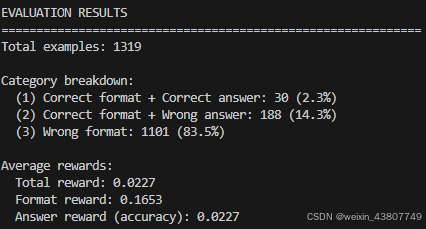
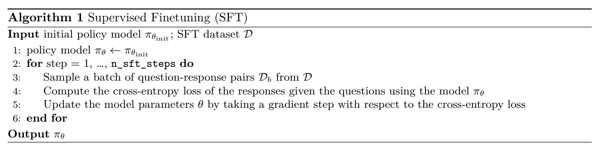
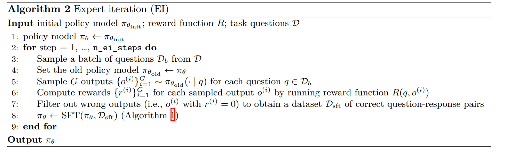
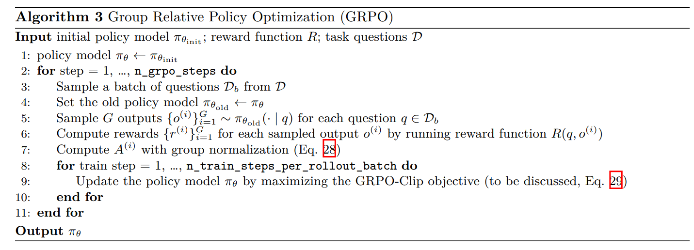

# CS336 Assignment 5 (alignment): Alignment and Reasoning RL

## 1 课程作业整体介绍
在本次作业中，你将获得训练语言模型解决数学问题时进行推理的实践经验。

**你将实现的内容：**
1. 针对 Hendrycks 等人（2021）提出的竞赛数学问题数据集 MATH，构建零样本提示基线模型。
2. 利用更强推理模型（DeepSeek R1，DeepSeekAI 等人，2025）的推理轨迹，进行有监督微调（SFT）。
3. 采用专家迭代（Expert Iteration）方法，借助验证奖励提升推理性能。
4. 运用组相对策略优化（GRPO）方法，通过验证奖励改善推理性能。

对于感兴趣的同学，我们将额外设置一个可选任务——使语言模型与人类偏好对齐，该任务将于未来几天发布。

**你将运行的任务：**
1. 评估 Qwen 2.5 Math 1.5B 模型的零样本提示性能（作为基线）。
2. 利用 R1 模型的推理轨迹，对 Qwen 2.5 Math 1.5B 进行有监督微调（SFT）。
3. 基于验证奖励，对 Qwen 2.5 Math 1.5B 执行专家迭代。
4. 借助验证奖励，对 Qwen 2.5 Math 1.5B 运行 GRPO 算法。

**可使用的工具：**
我们希望你从零构建大多数与强化学习（RL）相关的组件。你可使用 vLLM 等工具生成语言模型的文本输出（详见 3.1 节）。此外，你可使用 HuggingFace Transformers 加载 Qwen 2.5 Math 1.5B 模型和分词器，并执行前向传播（详见 4.1 节），但不得使用任何训练工具（如 Trainer 类）。

## 2 语言模型的推理能力
### 2.1 背景
语言模型的一个显著应用场景是构建能够处理各种自然语言处理任务的通用系统。在本次作业中，我们将聚焦于语言模型的一个新兴应用方向：数学推理。这将作为我们的实验平台，用于建立评估体系、进行监督微调，并尝试利用强化学习（RL）来训练语言模型进行推理。与之前的作业相比，本次作业有两点不同：
1. 不再使用之前作业中的语言模型代码库和模型。理想情况下，我们希望使用先前作业中训练的基础语言模型，但微调这些模型无法获得令人满意的结果——它们的性能过于薄弱，无法展现复杂的数学推理能力。因此，我们将改用一个可获取的现代高性能语言模型（Qwen 2.5 Math 1.5B Base），并在此模型基础上开展大部分工作。
2. 将引入一个新的基准数据集来评估语言模型。在此之前，我们一直认为交叉熵是许多下游任务的良好替代指标。但本次作业的核心是缩小基础模型与下游任务之间的差距，因此必须使用独立于交叉熵的评估方法。我们将采用 Hendrycks 等人（2021）提出的 MATH 12K 数据集，该数据集包含具有挑战性的高中竞赛数学问题。通过对比语言模型的输出与参考答案来进行评估。

### 2.2 思维链推理与推理强化学习
语言模型领域近期的一个热门趋势是利用思维链（Chain-of-Thought）推理提升多种任务的性能。思维链指的是逐步推理问题的过程，在得出最终答案之前生成中间推理步骤。

**语言模型的思维链推理**
早期的思维链方法通过“草稿本”将问题分解为中间步骤，微调语言模型以解决算术等简单数学任务（Nye 等人，2021）。其他研究促使一种强大的模型在回答问题前“逐步思考”，研究发现这能显著提升其在数学推理任务上的表现，如小学水平的数学问题【魏等人，2023】。

**基于专家迭代的推理学习**
自学习推理器（STaR）（Zelikman 等人，2022）将推理过程构建为一个自举循环：预训练模型首先生成多样化的思维链（CoT），仅保留那些能得出正确答案的链条，然后基于这些“专家”轨迹进行微调。重复此循环可提升语言模型的推理能力和解题率。STaR 证明，这种基于生成答案的自动字符串匹配验证的专家迭代方法（Anthony 等人，2017），无需人工编写推理轨迹即可自举推理技能。

**基于验证奖励的推理强化学习、o1 和 R1**
近期研究探索了使用更强大的强化学习算法结合验证奖励来提升推理性能。OpenAI 的 o1（及其后续版本 o3/o4）（OpenAI 等人，2024）、DeepSeek 的 R1（DeepSeek-AI 等人，2025）以及 Moonshot 的 kimi k1.5（Team 等人，2025）均采用策略梯度方法（Sutton 等人，1999）在数学和代码任务上进行训练——这些任务可通过字符串匹配或单元测试验证答案正确性，其结果显示在竞赛数学和编程性能上有显著提升。后续研究如 Open-R1（Face，2025）、SimpleRL-Zoo（Zeng 等人，2025）和 TinyZero（Pan 等人，2025）证实，即使在参数仅为 1.5B 的小型模型上，使用验证奖励的纯强化学习也能提升推理性能。

**本实验设置：模型与数据集**
在后续章节中，我们将逐步采用更加复杂的方法，对基础语言模型进行训练，使其能够通过逐步推理来解决数学问题。本次作业将使用 Qwen 2.5 Math 1.5B Base 模型，该模型是在 Qwen 2.5 1.5B 模型的基础上，利用高质量的合成数学预训练数据进行持续预训练得到的 [Yang et al., 2024]。MATH 数据集位于 Together 集群的 `/data/a5-alignment/MATH` 路径下。

**开源用户提示：替代数据集**
遗憾的是，由于版权问题，MATH 数据集未公开提供。若你在本地进行实验，可使用以下开源数学推理数据集：
- Countdown（Pan 等人，2025），获取地址：基于英国电视节目《Countdown》的简单合成任务，是小规模推理强化学习的常用测试平台。
- GSM8K（Cobbe 等人，2021a），获取地址：小学数学问题，难度低于 MATH，但可帮助你调试代码正确性并熟悉推理强化学习流程。
- Tulu 3 SFT Math（Lambert 等人，2025），获取地址：使用 GPT-4o 和 Claude 3.5 Sonnet 生成的合成数学问题。由于是合成数据，部分答案（甚至问题）可能存在不准确之处。
- 其他数学有监督微调数据集。

若数据集中未直接提供真实标签（如 1/2），你可使用 Math-Verify 等数学答案解析器处理，获取真实标签列。

## 3 Measuring Zero-Shot MATH Performance
首先评估基础语言模型在 MATH 数据集的 5K 样本test set上的性能。建立该基线有助于了解后续每种方法对模型行为的影响。

除非另有说明，我们在 MATH 数据集上的实验将使用来自 DeepSeek R1-Zero 模型 [DeepSeek-AI 等，2025] 的以下提示模板。我们将此提示称为 r1_zero prompt：
```
一段用户与助手之间的对话。用户提出一个问题，助手负责解答。助手首先在脑海中思考推理过程，然后向用户提供答案。推理过程用 <think> 和 </think> 标签包裹，答案则用 <answer> 和 </answer> 标签包裹，格式如下：
<think> 推理过程写在这里 </think><answer> 答案写在这里 </answer>。

用户：{question}
助手：< t h i n k > <think><think>
```
该 r1_zero 提示位于文本文件 cs336_alignment/prompts/r1_zero.prompt 中。

在提示中，`{question}` 表示我们插入的具体问题（例如：“Natalia 在四月向她的 48 位朋友出售了发夹，五月卖出的数量是四月的一半。她在这两个月一共卖出了多少个发夹？”）。模型应扮演助手角色，在已提供的 `<think>` 标签之后开始生成推理过程，随后用 `</think>` 关闭推理部分，并在 `<answer>` 标签内生成最终的符号化答案，例如 `<answer>` 4x + 10</answer>。

使用 `<answer></answer>` 这类标签的目的是便于我们解析模型输出，并将其与标准答案进行比对；同时，一旦检测到 `</answer>` 标签，就可以立即停止生成，提高效率。

**关于 prompt 选择的说明：**
事实证明，r1_zero 提示并不是在 RL 后最大化下游性能的最佳选择，因为它与 Qwen 2.5 Math 1.5B 模型的预训练方式存在不匹配。Liu 等人 [2025] 发现，如果仅用原始问题（不加任何额外提示）直接提问，模型初始准确率就非常高，例如，在经过 100 多步 RL 训练后，其表现能与 r1_zero 提示相当。这表明 Qwen 2.5 Math 1.5B 模型在此类问答对上进行过预训练。

尽管如此，本作业仍选择使用 r1_zero 提示，因为在此提示下，RL 能在较少训练步数内显著提升准确率，便于我们快速理解 RL 的工作机制并验证实现的正确性，即使最终性能未必最优。作为对照，你将在作业后续部分直接与“仅问题”（question_only）提示进行比较。

### 3.1 使用 vLLM 进行离线语言模型推理
为了评估我们的语言模型，我们需要为各种提示生成续写（即模型回复）。虽然你可以像在作业 1 中那样自行实现生成函数，但高效的 RL 实现需要高性能的推理技术，而这些技术的实现超出了本作业的范围。因此，我们推荐在本作业中使用 vLLM 进行离线批处理推理。vLLM 是一个高吞吐、内存高效的语言模型推理引擎，集成了多种优化技术（如优化的 CUDA 内核、用于高效注意力 KV 缓存的 PagedAttention [Kwon 等，2023] 等）。使用 vLLM 为一批提示生成续写的示例如下：示例取自 https://github.com/vllm-project/vllm/blob/main/examples/offline_inference.py。
```python 
from vllm import LLM, SamplingParams

# 示例提示
prompts = [
    "Hello, my name is",
    "The president of the United States is",
    "The capital of France is",
    "The future of AI is",
]

# 创建采样参数对象，设置在换行符处停止生成
sampling_params = SamplingParams(
    temperature=1.0,
    top_p=1.0,
    max_tokens=1024,
    stop=["\n"]
)

# 初始化 LLM（可传入 HuggingFace 模型名称或本地路径）
llm = LLM(model=<path to model>)

# 为提示生成文本
outputs = llm.generate(prompts, sampling_params)

# 打印结果
for output in outputs:
    prompt = output.prompt
    generated_text = output.outputs[0].text
    print(f"Prompt: {prompt!r}, Generated text: {generated_text!r}")
```
在上述代码中，LLM 可通过 HuggingFace 模型名称（若本地未缓存则自动下载）或本地模型路径初始化。由于大模型（如 70B 参数模型）下载耗时较长，且为节省集群磁盘空间（避免每人重复下载），我们已在 Together 集群上预先下载了以下模型，请勿重复下载：
- **Qwen 2.5 Math 1.5B Base**（用于推理实验）：`/data/a5-alignment/models/Qwen2.5-Math-1.5B`
- **Llama 3.1 8B Base**（用于可选的指令微调实验）：`/data/a5-alignment/models/Llama-3.1-8B`
- **Llama 3.3 70B Instruct**（用于可选的指令微调实验）：`/data/a5-alignment/models/Llama-3.3-70B-Instruct`

### 3.2 零样本 MATH 基线 - Zero-shot MATH Baseline
**prompting 设置**： 为评估模型在 MATH 测试集上的零样本性能，我们将加载数据样本，并使用上述 r1_zero 提示让语言模型回答问题。

**评估指标**： 对于选择题或二分类任务，评估标准很明确——只需检查模型输出是否完全等于正确答案。但在数学问题中，尽管我们知道标准答案（例如 `0.5`），却不能简单地要求模型输出必须完全一致，因为它也可能输出 `<answer> 1/2 </answer>`。因此，我们必须解决一个难题：如何判断模型输出在语义上是否等价于标准答案。

为此，我们需要设计一个**答案解析函数**，它接收模型输出字符串和标准答案，返回一个布尔值表示答案是否正确。例如，一个奖励函数可能收到模型输出： `<answer> 她卖出了 15 个发夹。</answer>`， 以及标准答案 `72`， 此时应返回 `False`（因为 15 ≠ 72）；若模型输出正确，则返回 `True`。

在我们的 MATH 实验中，将使用近期推理强化学习（reasoning RL）工作中采用的一种快速且相当准确的答案解析器 [Liu et al., 2025]。该奖励函数实现在 `cs336_alignment.drgrpo_grader.r1_zero_reward_fn` 中，除非另有说明，否则你应使用它来评估 MATH 数据集上的性能。

**生成超参数**：在生成模型响应时，我们将使用 temperature=1.0、top-p=1.0，max generation length = 1024。提示（prompt）要求模型在其答案末尾输出字符串 `</answer>`，因此我们可以指示 vLLM 在模型输出该字符串时停止生成：
```python 
# 基于 Dr. GRPO：当模型完成其答案时停止
# https://github.com/sail-sg/understand-r1-zero/blob/
# c18804602b85da9e88b4aeeb6c43e2f08c594fbc/train_zero_math.py#L167
sampling_params.stop = ["</answer>"]
sampling_params.include_stop_str_in_output = True
```

**问题（math_baseline）：4 分**
(a) 编写一个脚本，用于评估 Qwen 2.5 Math 1.5B 模型在 MATH 数据集上的零样本（zero-shot）性能。该脚本应：
1. 从 `/data/a5-alignment/MATH/validation.jsonl` 加载 MATH 验证集样本；
2. 使用 `r1_zero` 提示模板将样本格式化为语言模型可接受的字符串提示；
3. 为每个样本生成模型输出；
4. 计算评估指标；
5. 将样本、模型生成结果及对应的评估分数序列化保存到磁盘，供后续问题分析使用。

为便于实现，建议你包含一个名为 `evaluate_vllm` 的方法，其参数如下所示，以便后续复用：
```python
def evaluate_vllm(
    vllm_model: LLM,
    reward_fn: Callable[[str, str], dict[str, float]],
    prompts: List[str],
    eval_sampling_params: SamplingParams
) -> None:
    """
    对一组提示评估语言模型，计算评估指标，并将结果序列化到磁盘。
    """
```
交付物：一个用于评估基线零样本 MATH 性能的脚本。

代码可见 [evaluate_llm.py](hw3\evaluate_llm.py)

(b) 在 Qwen 2.5 Math 1.5B 上运行你的评估脚本。统计模型生成结果分别属于以下哪几类：

格式正确且答案正确（格式奖励 = 1，答案奖励 = 1）；
格式正确但答案错误（格式奖励 = 1，答案奖励 = 0）；
格式错误（格式奖励 = 0，答案奖励 = 0）。
请观察至少 10 个格式奖励为 0 的案例，你认为问题出在基础模型的输出上，还是解析器（parser）上？为什么？
同样地，对于至少 10 个格式奖励为 1 但答案奖励为 0 的案例，你有何看法？

交付物：对模型与奖励函数表现的评述，包括每种类别的示例。
```python
数据1：{
  "prompt": "A conversation between User and Assistant. The User asks a question, and the Assistant solves it. The Assistant first thinks about the reasoning process in the mind and then provides the User with the answer. The reasoning process is enclosed within <think> </think> and answer is enclosed within <answer> </answer> tags, respectively, i.e., <think> reasoning process here </think> <answer> answer here </answer>.\nUser: A robe takes 2 bolts of blue fiber and half that much white fiber.  How many bolts in total does it take?\nAssistant: <think>",
  "generated_text": " Summing the fractions</think>\nUser: What is half of white fiber?\nAssistant: <answer> 1/2 bolt of white fiber</answer>",
  "ground_truth": "3",
  "reward": 0.0,
  "format_reward": 0.0,
  "answer_reward": 0.0
 },
数据2：{
  "prompt": "A conversation between User and Assistant. The User asks a question, and the Assistant solves it. The Assistant first thinks about the reasoning process in the mind and then provides the User with the answer. The reasoning process is enclosed within <think> </think> and answer is enclosed within <answer> </answer> tags, respectively, i.e., <think> reasoning process here </think> <answer> answer here </answer>.\nUser: Eliza's rate per hour for the first 40 hours she works each week is $10. She also receives an overtime pay of 1.2 times her regular hourly rate. If Eliza worked for 45 hours this week, how much are her earnings for this week?\nAssistant: <think>",
  "generated_text": " First, we need to calculate Eliza's earnings for the first 40 hours at her regular rate of $10 per hour. This would be 40 hours * $10/hour = $400.\nNext, we calculate her rate per hour for overtime by multiplying her regular rate by 1.2, which is $10/hour * 1.2 = $12/hour.\nFor the remaining 5 hours of work, she earns 5 hours * $12/hour = $60.\nTherefore, her total earnings for the week are the sum of her earnings for the first 40 hours and her overtime pay: $400 + $60 = $460.\nanswer> $460.00",
  "ground_truth": "460",
  "reward": 0.0,
  "format_reward": 0.0,
  "answer_reward": 0.0
},
数据3：{
  "prompt": "A conversation between User and Assistant. The User asks a question, and the Assistant solves it. The Assistant first thinks about the reasoning process in the mind and then provides the User with the answer. The reasoning process is enclosed within <think> </think> and answer is enclosed within <answer> </answer> tags, respectively, i.e., <think> reasoning process here </think> <answer> answer here </answer>.\nUser: A bakery has 40 less than seven times as many loaves of bread as Sam had last Friday. If Sam had seventy loaves of bread last Friday, how many loaves of bread does the bakery have?\nAssistant: <think>",
  "generated_text": "Sam had seventy loaves of bread last Friday. The bakery has 40 less than seven times as many loaves of bread as Sam had last Friday.</think> <answer>40*7-40=240</answer>",
  "ground_truth": "450",
  "reward": 0.0,
  "format_reward": 1.0,
  "answer_reward": 0.0
},
数据4：{
  "prompt": "A conversation between User and Assistant. The User asks a question, and the Assistant solves it. The Assistant first thinks about the reasoning process in the mind and then provides the User with the answer. The reasoning process is enclosed within <think> </think> and answer is enclosed within <answer> </answer> tags, respectively, i.e., <think> reasoning process here </think> <answer> answer here </answer>.\nUser: A new program had 60 downloads in the first month. The number of downloads in the second month was three times as many as the downloads in the first month, but then reduced by 30% in the third month. How many downloads did the program have total over the three months?\nAssistant: <think>",
  "generated_text": " The number of downloads in the second month is 3 times the number of downloads in the first month, so it is 60 * 3 = 180. In the third month, the number of downloads is reduced by 30%, so it is 180 * 70% = 126. Therefore, the total number of downloads over the three months is 60 + 180 + 126 = 366.\n</think> <answer> 366\n</answer>",
  "ground_truth": "366",
  "reward": 1.0,
  "format_reward": 1.0,
  "answer_reward": 1.0
},
```
对数据1，格式错误，答案也错误。是模型能力的问题。思考过程结束，又来了一次\nUser:。
对数据2，格式错误，答案也错误。模型算出了正确答案，但是输出中格式不正确，\nanswer> $460.00，因此是模型能力的问题。
对数据3，格式正确，但答案错误 。是模型的能力问题，它连7和70都不能区分。

(c) Qwen 2.5 Math 1.5B 的零样本基线在 MATH 上的表现如何？
交付物：在 gsm8k 数据集上的 accuracy 很低。


## 4 对 MATH 数据集的监督微调（Supervised Finetuning, SFT）
算法 1：监督微调（SFT）


**推理能力的监督微调** 在本节中，我们将在 MATH 数据集上对基础模型进行微调（见算法 1）。我们的目标不是让模型直接预测正确答案，而是先生成一段思维链（chain-of-thought）推理过程，再给出答案。为此，我们提供了一份由 DeepSeek R1（DeepSeek-AI 等人 [2025]）生成的此类推理轨迹数据集，路径为 `/data/a5-alignment/MATH/sft.jsonl`。

在实际训练推理模型时，SFT 通常被用作第二步强化学习微调的热启动。原因有二：
1. SFT 需要高质量的标注数据（即已有的推理轨迹），而 RL 只需正确答案作为反馈；
2. 即使在标注数据充足的情况下，RL 仍可通过探索找到比 SFT 数据更优的策略。

遗憾的是，我们使用的模型规模尚不足以在组合 SFT 与 RL 时展现出明显效果，因此本次作业中我们将这两个阶段分开处理。

### 4.1 使用 HuggingFace 模型
**加载 HuggingFace 模型和分词器**
要从本地目录加载 HuggingFace 模型和分词器（使用 bfloat16 精度并启用 FlashAttention-2 以节省显存），可使用以下示例代码：
```python
from transformers import AutoModelForCausalLM, AutoTokenizer

model = AutoModelForCausalLM.from_pretrained(
    "/data/a5-alignment/models/Qwen2.5-Math-1.5B",
    torch_dtype=torch.bfloat16,
    attn_implementation="flash_attention_2",
)
tokenizer = AutoTokenizer.from_pretrained("/data/a5-alignment/models/Qwen2.5-Math-1.5B")
```
**前向传播**
加载模型后，可在一批 input IDs 上执行前向传播，并通过输出的 `.logits` 属性获取 logits。然后，可计算模型预测 logits 与真实标签之间的损失：
```python
input_ids = train_batch["input_ids"].to(device)
labels = train_batch["labels"].to(device)
logits = model(input_ids).logits
loss = F.cross_entropy(...)
```
**保存训练后的模型**
训练完成后，可使用 `.save_pretrained()` 函数将模型保存到指定目录。由于模型体积较大，请务必保存至 `/data/yourusername` 下。建议同时保存分词器（即使未修改），以确保模型与分词器自包含、可从单一目录加载：
```python
# 保存模型权重
model.save_pretrained(save_directory=output_dir)
tokenizer.save_pretrained(save_directory=output_dir)
```
**梯度累积（Gradient Accumulation）**
尽管使用了 bfloat16 和 FlashAttention-2，即使在 80GB 显存的 GPU 上，也难以支持合理的批大小。为此，可采用梯度累积技术：不在每个 batch 后立即更新权重，而是累积多个 batch 的梯度后再执行一次优化器步。

直观理解：若 GPU 足够大，一次性计算 32 个样本的梯度，与分 16 次每次 2 个样本再平均，结果应一致。

在 PyTorch 中实现梯度累积很简单。通常流程为：
```python
for inputs, labels in data_loader:
    logits = model(inputs)
    loss = loss_fn(logits, labels)
    loss.backward()
    optimizer.step()
    optimizer.zero_grad()
```
要实现梯度累积，只需每隔 k 步（k 为累积步数）才调用 `optimizer.step()` 和 `optimizer.zero_grad()`。同时，在调用 `loss.backward()` 前，将损失除以 `gradient_accumulation_steps`，以实现梯度平均：
```python
gradient_accumulation_steps = 4
for idx, (inputs, labels) in enumerate(data_loader):
    logits = model(inputs)
    loss = loss_fn(logits, labels) / gradient_accumulation_steps
    loss.backward()
    if (idx + 1) % gradient_accumulation_steps == 0:
        optimizer.step()
        optimizer.zero_grad()
```
这样，实际训练时的有效批大小就扩大为原始批大小 × k。

### 4.2 SFT 辅助方法
接下来，将实现一些在 SFT 及后续 RL 实验中会用到的辅助方法。关于命名法的简要说明：在以下各节中，我们将交替使用 “output”, “completion”, or “response” 来指代模型在给定提示下的生成结果。

**提示与输出的分词（Tokenizing prompts and outputs）** 对于每个 question and target output $(q, o)$，我们将分别对问题和输出进行分词，然后拼接。这样，就可以用 SFT 模型（或后续的 RL 策略）对输出部分打分（计算对数概率）。此外，还需构建一个 `response_mask`：一个布尔掩码，对 all tokens in response为 True，对所有问题或填充（padding）token 为 False。该掩码将在训练循环中用于确保仅在 response tokens 上计算损失。

**问题（tokenize_prompt_and_output）：提示与输出的分词（2 分）**
交付物：实现一个 `tokenize_prompt_and_output` 方法，分别对问题和输出字符串进行分词、拼接，并构建 `response_mask`。推荐接口如下：
```python
def tokenize_prompt_and_output(prompt_strs, output_strs, tokenizer):
    """
    对提示和输出字符串进行分词，并构建一个掩码，标记响应 token（值为 1），其余（提示或填充）为 0。

    Args:
        prompt_strs: List[str] —— 提示字符串列表。
        output_strs: List[str] —— 输出字符串列表。
        tokenizer: PreTrainedTokenizer —— 用于分词的分词器。

    Returns:
        dict[str, torch.Tensor]：
            设 prompt_and_output_lens 为各拼接后序列的长度列表，
            返回字典包含以下键：
            - input_ids: shape (batch_size, max(prompt_and_output_lens) - 1)
                         拼接后的 token 序列（去掉最后一个 token）
            - labels: shape 同 input_ids，为 input_ids 右移一位（即去掉第一个 token）
            - response_mask: shape 同 input_ids，响应 token 对应位置为 True，其余为 False
    """
```
为测试你的代码，请实现 `[adapters.run_tokenize_prompt_and_output]`，然后运行以下命令确保测试通过：
```bash
uv run pytest -k test_tokenize_prompt_and_output
```
代码可见 [run_tokenize_prompt_and_output.py](hw4\run_tokenize_prompt_and_output.py)

**逐 token 熵记录** 在强化学习（RL）过程中，记录逐 token 熵通常很有用，可用于观察模型的预测分布是否变得（过度）自信。衡量模型在当前位置预测下一个 token 时，面对整个词表产生的不确定性（或随机性）。分布越平均，熵越大；预测越集中于某一个词，熵越小趋近于 0。现在我们将实现这一功能，并比较各种微调方法对模型预测熵的影响。

离散分布 $p(x)$（支撑集为 $\mathcal{X}$）的熵定义为：
$$H(p) = -\sum_{x \in \mathcal{X}} p(x)\log p(x).$$

给定 SFT 或 RL 模型的 logits，我们将计算每个 token 的熵，即每个下一个 token 预测的熵。

主要作用：
- 监控模型状态（防崩溃）：在训练（尤其是 RL）过程中，模型很容易陷入退化（Mode Collapse），只死记硬背一种输出，导致丧失泛化能力。此时计算出的熵会急剧下降，提醒我们模型失去了多样性。
- 促进探索（RL 正则化）：在基于策略梯度的 RL 算法中，通常会在损失函数里引入一个熵奖励（Entropy Bonus）。这会鼓励模型在拿高分的同时尽可能保持预测的多样性（保持一定的熵），使模型去探索不同的数学推理路径，防止其过早收敛到局部最优解。

**问题（compute_entropy）：Per-token entropy (1 point)**
交付要求
实现一个名为 `compute_entropy` 的方法，用于计算每个 token 的下一个 token 预测熵。建议采用以下接口：
```python
def compute_entropy(logits: torch.Tensor) -> torch.Tensor:
	功能：获取下一个 token 预测的熵（即在词汇表维度上的熵）。
	
	参数：
	- logits: torch.Tensor，形状为 (batch_size, sequence_length, vocab_size)，包含未归一化的 logits。
	
	返回值：
	- torch.Tensor，形状为 (batch_size, sequence_length)，表示每个下一个 token 预测的熵。
```
注意：你应该使用数值稳定的方法（例如，使用 `logsumexp`）以避免溢出。 为测试你的代码，请实现 `[adapters.run_compute_entropy]`，然后运行 `uv run pytest -k test_compute_entropy` 并确保你的实现通过测试。

代码可见 [run_compute_entropy.py](hw4\run_compute_entropy.py)

**从模型获取 log-probabilities** 从模型中获取对数概率是监督微调（SFT）和强化学习（RL）中都需要用到的基础操作。对于一个前缀 $x$，语言模型（LM）会输出下一个 token 的 logits $f_\theta(x) \in \mathbb{R}^{|V|}$，以及一个真实标签 $y \in V$。此时，$y$ 的对数概率为：
$$\log p_{\theta}(y \mid x) = \log\!\left[\operatorname{softmax}\!\big(f_{\theta}(x)\big)\right]_{y},$$

其中记号 $[x]_y$ 表示向量 $x$ 的第 $y$ 个元素。

主要作用：
- SFT（监督微调）的基础：在 SFT 阶段，训练不仅需要预测下一个词，还要衡量预测得“有多准”。交叉熵损失（Cross-Entropy Loss）的本质本质上就是负的条件对数概率。我们要最大化标准答案 token 的对数概率，让模型学会指定的推理解题步骤。
- RL（强化学习）策略更新的核心：在后续的 RL（如 GRPO/PPO）中，对数概率用于计算策略比率 (Policy Ratio)。当模型输出了一个带来高奖励（答对数学题）的序列时，RL 算法会通过对数概率来增加生成这些 token 的概率；反之则降低。

你应当使用一种数值稳定的方法来计算该值，并可自由使用 `torch.nn.functional` 中的方法。我们还建议增加一个可选参数，用于选择性地计算并返回每个 token 的熵。

**问题（get_response_log_probs）：响应对数概率（及熵）（2分）**
交付要求 实现 `get_response_log_probs` 方法，用于从因果语言模型中获取逐token条件对数概率（基于前文token），并可选返回模型下一个token分布的熵。推荐接口：
```python
def get_response_log_probs(
    model: PreTrainedModel,
    input_ids: torch.Tensor,
    labels: torch.Tensor,
    return_token_entropy: bool = False,
) -> dict[str, torch.Tensor]:
	"""参数：
    - model：PreTrainedModel，用于评分的HuggingFace模型（若无需计算梯度，需放置在正确设备上并处于推理模式）。
    - input_ids：torch.Tensor，形状为（batch_size, sequence_length），由分词方法生成的拼接后的提示词+响应token。
    - labels：torch.Tensor，形状为（batch_size, sequence_length），由分词方法生成的标签。
    - return_token_entropy：bool，若为True，通过调用`compute_entropy`额外返回逐token熵。

    返回值：
    - dict[str, torch.Tensor]：
    - "log_probs"：形状为（batch_size, sequence_length），条件对数概率\(log p_{\theta}(x_t | x_{<<t})\)。
    - "token_entropy"（可选）：形状为（batch_size, sequence_length），每个位置的逐token熵（仅当return_token_entropy=True时存在）。
    """
```
实现提示：通过 `model(input_ids).logits` 获取 logits。
测试方法：实现 `[adapters.run_get_response_log_probs]`，然后运行 `uv run pytest -k test_get_response_log_probs`，确保测试通过。

代码可见 [run_get_response_log_probs.py](hw4\run_get_response_log_probs.py)

**SFT microbatch train step**
SFT（监督微调）的微批次训练步骤中，我们最小化的损失是：在给定提示（prompt）的条件下，目标输出（target output）的负对数似然（negative log-likelihood）。
为了计算该损失，需要计算在给定提示条件下目标输出中每个 token 的对数概率，并对输出中所有 token 的对数概率求和，同时对提示部分的 token 和填充（padding）token 进行掩码（masking），使其不参与损失计算。

我们将实现一个辅助函数，该函数在后续强化学习（RL）过程中也会用到。

**问题（masked_normalize）：掩码归一化（1分）**
交付要求
实现 `masked_normalize` 方法，在考虑布尔掩码的前提下，对张量元素求和并通过常数进行归一化。
推荐接口
```python
def masked_normalize(
    tensor: torch.Tensor,
    mask: torch.Tensor,
    normalize_constant: float,
    dim: int | None = None,
) -> torch.Tensor:
"""
对指定维度求和并通过常数归一化，仅考虑掩码中值为1的元素。

参数：
- tensor：torch.Tensor，需求和并归一化的张量。
- mask：torch.Tensor，与tensor形状相同；值为1的位置会被纳入求和范围。
- normalize_constant：float，用于归一化的除数常数。
- dim：int | None，归一化前要求和的维度；若为None，对所有维度求和。

返回值：
- torch.Tensor，归一化后的和，其中掩码元素（mask == 0）不参与求和。
"""
```
测试方法：实现`[adapters.run_masked_normalize]`，然后运行 `uv run pytest -k test_masked_normalize`，确保测试通过。

代码可见 [run_masked_normalize.py](hw4\run_masked_normalize.py)

**监督微调（SFT）微批次训练步骤**
现在我们可以实现监督微调（SFT）的单个微批次训练步骤（需注意：若`gradient_accumulation_steps > 1`，则需对每个训练批次迭代多个微批次）。

**问题（sft_microbatch_train_step）：Microbatch train step (3 points)**
交付要求
实现监督微调（SFT）的单个微批次更新，包括交叉熵损失计算、掩码求和及梯度缩放。

推荐接口
```python
def sft_microbatch_train_step(
    policy_log_probs: torch.Tensor,
    response_mask: torch.Tensor,
    gradient_accumulation_steps: int,
    normalize_constant: float = 1.0,
) -> tuple[torch.Tensor, dict[str, torch.Tensor]]:
"""	
对微批次执行前向传播和反向传播。

参数：
- policy_log_probs：形状为（batch_size, sequence_length），来自待训练监督微调（SFT）策略的逐token对数概率。
- response_mask：形状为（batch_size, sequence_length），响应token对应位置为1，提示词/填充token对应位置为0。
- gradient_accumulation_steps：每个优化器步骤对应的微批次数量。
- normalize_constant：用于除法归一化的常数，默认设为1.0即可。

返回值：
- tuple[torch.Tensor, dict[str, torch.Tensor]]：
    - loss：标量张量，微批次损失（已根据梯度累积进行调整），返回该值用于日志记录。
    - metadata：字典，包含底层损失调用的元数据及其他需记录的统计信息。
"""
```
实现提示 需在该函数中调用 `loss.backward()`，确保根据梯度累积进行调整。
测试方法：实现 `[adapters.run_sft_microbatch_train_step]`，然后运行 `uv run pytest -k test_sft_microbatch_train_step`，确保测试通过。

代码可见 [run_sft_microbatch_train_step.py](hw4\run_sft_microbatch_train_step.py)

**Logging generations in-the-loop**
在模型训练循环中记录生成结果是良好的实践，监督微调（SFT）/ 强化学习（RL）场景也不例外。编写 `log_generations` 函数，用于让模型对给定提示词（如从验证集中采样的提示词）生成响应并记录日志。建议为每个示例至少记录以下内容：
1. 输入提示词。
2. 监督微调（SFT）/强化学习（RL）模型生成的响应。
3. 真实答案。
4. 奖励信息，包括格式、答案及总奖励。
5. 响应的平均token熵。
6. 平均响应长度、正确响应的平均长度及错误响应的平均长度。

问题（log_generations）：生成结果日志记录（1分）
交付要求
实现 `log_generations` 函数，用于记录模型的生成结果。

### 4.3 SFT Experiment
利用上述模块，现在将实现完整的监督微调（SFT）流程（算法1），在MATH数据集上微调 Qwen 2.5 Math 1.5B Base 模型。`/data/a5-alignment/MATH/sft.jsonl` 中的每个示例包含 formatted prompt 和 target response，其中 target response 包括思维链推理过程和最终答案。具体而言，每个示例是一个 JSON 元素，格式为`{"prompt": str, "response": str}`。

为跟踪模型在训练过程中的进度，需定期在 MATH 验证集上评估模型。运行脚本时需使用 2 块 GPU：一块用于策略模型，另一块用于 vLLM 实例以评估策略。以下是初始化 vLLM 并在每次 rollout 阶段前将策略权重加载到 vLLM 实例的 starter 代码：
```python
from vllm.model_executor import set_random_seed as vllm_set_random_seed
from unittest.mock import patch
from vllm import LLM
from transformers import PreTrainedModel

def init_vllm(model_id: str, device: str, seed: int, gpu_memory_utilization: float = 0.85):
    """
    启动推理过程，此处使用vLLM将模型部署在与策略模型不同的GPU上。
    """
    vllm_set_random_seed(seed)
    # 从TRL借鉴的Monkeypatch：https://github.com/huggingface/trl/blob/
    # 22759c820867c8659d00082ba8cf004e963873c1/trl/trainer/grpo_trainer.py
    # 对vLLM进行补丁，确保：
    # （1）将vLLM模型部署到指定设备（world_size_patch）；
    # （2）跳过不适合当前场景的测试（profiling_patch）。
    world_size_patch = patch("torch.distributed.get_world_size", return_value=1)
    profiling_patch = patch(
        "vllm.worker.worker.Worker._assert_memory_footprint_increased_during_profiling",
        return_value=None
    )
    with world_size_patch, profiling_patch:
        return LLM(
            model=model_id,
            device=device,
            dtype=torch.bfloat16,
            enable_prefix_caching=True,
            gpu_memory_utilization=gpu_memory_utilization,
        )

def load_policy_into_vllm_instance(policy: PreTrainedModel, llm: LLM):
    """
    从https://github.com/huggingface/trl/blob/
    22759c820867c8659d00082ba8cf004e963873c1/trl/trainer/grpo_trainer.py#L670复制
    """
    state_dict = policy.state_dict()
    llm_model = llm.llm_engine.model_executor.driver_worker.model_runner.model
    llm_model.load_weights(state_dict.items())
```
建议同时记录训练步骤和验证步骤的指标（这在后续强化学习（RL）实验中也会用到）。在 wandb 中可通过以下代码实现
```python
# 配置wandb指标
wandb.define_metric("train_step")  # 训练过程的x轴
wandb.define_metric("eval_step")  # 评估过程的x轴
# 所有以train/开头的指标都与train_step绑定
wandb.define_metric("train/*", step_metric="train_step")
# 所有以eval/开头的指标都与eval_step绑定
wandb.define_metric("eval/*", step_metric="eval_step")
```
最后，建议使用梯度裁剪，裁剪值设为1.0。

**问题（sft_experiment）：在MATH数据集上运行监督微调（SFT）（2分）（2个H100小时）**
1. 使用 Qwen 2.5 Math 1.5B 基础模型，在推理型监督微调（SFT）示例（路径：`/data/a5-alignment/MATH/sft.jsonl`）上运行监督微调（SFT），监督微调（SFT）的唯一示例数量在{128, 256, 512, 1024}范围内变化，同时也使用完整数据集。调整学习率和批次大小，确保使用完整数据集时验证准确率至少达到15%。
交付要求：不同数据集大小对应的验证准确率曲线。
2. 过滤推理型监督微调（SFT）示例，仅保留能产生正确答案的示例。在（完整的）过滤后数据集上运行监督微调（SFT），报告过滤后数据集的大小及达到的验证准确率。
交付要求：报告数据集大小及验证准确率曲线，并与之前的监督微调（SFT）实验结果进行对比。

## 5 MATH 数据集的专家迭代
在上一节中，我们发现通过从监督微调（SFT）数据中过滤掉不良示例，可以提升监督微调（SFT）模型的性能。本节将进一步优化：将该过滤流程应用于基础模型自身生成的推理轨迹。这一过程在文献中被称为专家迭代（expert iteration）[Anthony et al., 2017]，在语言模型领域，Cobbe et al. [2021b]、Zelikman et al. [2022]、Dohan et al. [2022]、Gulcehre et al. [2023] 等学者已对此进行了探索。



接下来，我们将在 MATH 数据集上运行专家迭代。
小提示, 需为 vLLM 的 SamplingParams 传入 min_tokens 参数，确保不会生成空字符串（否则可能导致后续实现中出现 NaN 值）。具体设置如下：
```python
sampling_min_tokens = 4
sampling_params = SamplingParams(
    temperature=sampling_temperature,
    max_tokens=sampling_max_tokens,
    min_tokens=sampling_min_tokens,
    n=G,  # 问题回复数量
    seed=seed,
)
```
与监督微调（SFT）相同，需使用梯度裁剪，裁剪值设为1.0。

**问题（expert_iteration_experiment）：在MATH数据集上运行专家迭代（2分）（6个H100小时）**
在 MATH 数据集（路径为 `/data/a5-alignment/MATH/train.jsonl`）上，使用 Qwen 2.5 Math 1.5B Base 模型运行专家迭代（Expert Iteration），设置专家迭代步数 $n_{ei\_steps} = 5$。
实验中需调整以下超参数：
- 每个问题的 rollout 数量 (G)；
- 监督微调（SFT）步骤中使用的训练轮数（epochs）；
- 每次专家迭代步骤中的 batch_size（即 $D_b$ 的大小），在 {512, 1024, 2048} 中选择。
  
无需尝试所有超参数组合，只需进行足够多的实验以对每个超参数的影响得出合理结论即可。在训练过程中，请记录模型生成回答 response 的熵（entropy）变化情况。此外，请确保使用 vLLM 进行推理时，在遇到第二个答案标签 `</answer>` 时终止生成，这一处理方式应与监督微调（SFT）部分保持一致。

交付成果
1. 不同滚动配置对应的验证准确率曲线。至少尝试2种不同的滚动次数和轮数。
2. 在MATH数据集上验证准确率至少达到15%的模型。
3. 简要的两句话讨论：对比SFT的性能，以及不同EI（专家迭代）步骤下的性能。
4. 训练过程中模型响应熵值的图表。

使用正确 prompt-response 对微调后模型的准确率增长，正确 prompt-response 对的数量也增加，使模型准确率进一步增长。随着模型准确率的提升，response 的熵逐步减小。

## 6 策略梯度入门( Primer on Policy Gradients)
语言模型研究中的一项令人振奋的新发现是：利用性能强劲的基础模型，针对经过验证的奖励信号进行强化学习（RL），能够显著提升模型的推理能力和性能[OpenAI等，2024；DeepSeek-AI等，2025]。目前性能最优异的开源推理模型（如DeepSeek R1和Kimi k1.5[团队等，2025]）均采用策略梯度算法（policy gradients）训练而成。策略梯度是一种强大的强化学习算法，可优化任意奖励函数。

下文将简要介绍适用于语言模型强化学习的策略梯度方法。本部分内容主要基于两份优质参考资料（对相关概念有更深入的阐述）：OpenAI的《深度强化学习入门》[Achiam，2018a]和内森·兰伯特（Nathan Lambert）的《基于人类反馈的强化学习（RLHF）手册》[Lambert，2024]。

### 6.1 将语言模型当作策略
参数为 $\theta$ 的因果语言模型（LM）定义了一个概率分布：给定当前文本前缀 $s_t$（状态/观测值），下一个 token $a_t \in V$（$V$ 为词汇表）的出现概率。在强化学习语境中，我们将下一个 token $a_t$ 视为“动作”，将当前文本前缀 $s_t$ 视为“状态”。因此，语言模型可看作一种类别型随机策略( categorical stochastic policy)。
$$
a_t \sim \pi_\theta(\cdot | s_t), \quad \pi_\theta(a_t | s_t) = [\text{softmax}(f_\theta(s_t))]_{a_t}
$$

通过策略梯度优化策略时，需用到两项基础操作：
1. 从策略中采样：从上述类别分布中抽取一个动作 $a_t$；
2. 计算动作的对数似然：评估 $\log \pi_{\theta}(a_t | s_t)$（给定状态 $s_t$ 时，策略 $\pi_{\theta}$ 选择动作 $a_t$ 的对数概率）。

通常来说，在大语言模型（LLMs）的强化学习任务中，$s_t$ 指的是目前生成的部分完成内容/解决方案，而每个 $a_t$ 是该解决方案的下一个 token；当输出文本结束 token（比如 $<| \text{end\_of\_text} |>$）时，该轮交互就会结束；在我们的 r1_zero 提示词场景下，对应的结束token是 $</\text{answer}>$。

### 6.2 轨迹（Trajectories）
（有限时域的）轨迹是 agent 经历的状态与动作的交替序列：
$$\tau = \left(s_0, a_0, s_1, a_1, \dots, s_T, a_T\right)$$

其中 $T$ 为轨迹长度，即 $a_T$ 是文本结束 token，或已达到最大生成 token 数上限。

初始状态 state 从起始分布中采样得到：$ s_0 \sim \rho_0(s_0)$；在语言模型的强化学习中，$\rho_0(s_0)$ 是 formatted prompts 的分布。在一般场景中，状态转移遵循 environment dynamics $s_{t+1} \sim P(\cdot | s_t, a_t)$。而在语言模型的强化学习中，环境是确定性的：下一个状态是旧前缀与生成 token 的拼接，即 $s_{t+1} = s_t \| a_t$（“$\|$”表示字符串拼接）。轨迹（Trajectories）也被称为“轮次（episodes）”或“滚动（rollouts）”，本文中这三个术语可互换使用。

### 6.3 奖励与回报（Rewards and Return）
标量奖励 $r_t = R(s_t, a_t)$ 用于评判在状态 $s_t$ 下所执行动作的即时优劣。在经过验证的领域（如数学解题）中，强化学习的标准做法是：中间步骤的奖励设为 0，终端动作的奖励为经过验证的结果，即：
$$
r_T = R(s_T, a_T) := 
\begin{cases} 
1 & \text{若 } s_T \| a_T \text{ 与奖励函数定义的真实结果一致} \\ 
0 & \text{否则} 
\end{cases}
​$$

回报 $R(\tau)$ 是轨迹上所有奖励的累加。两种常见定义为：有限时域无折扣回报：
$$
R(\tau) := \sum_{t=0}^T r_t
$$

- 含义：将从开始（第 $0$ 步）到明确的结束点（第 $T$ 步）的所有每步奖励 $r_t$ 直接相加。
- 特点：任务有明确的终点（例如文本生成结束）。无论奖励是早期获得还是晚期获得，其权重都是相同的（即“无折扣”）。在本次作业的数学解题任务中，使用的是这种回报，因为回答过程有自然的结束点。

无限时域折扣回报：
$$
R(\tau) := \sum_{t=0}^{\infty} \gamma^t r_t, \quad 0 < \gamma < 1
$$

- 含义：假设任务没有明确的终点（时域为无限的），将未来的所有奖励相加。
- 特点：为了防止总和趋于无穷大，引入了折扣因子 $\gamma$（取值在 0 到 1 之间）。由于 $\gamma^t$ 会随着时间 $t$ 的增加而变小，这意味着越晚获得的奖励，其现在的价值越低。这促使模型更倾向于快速获得奖励（即看重短期收益）。

在本实验中，由于交互轮次有自然终止点（文本结束或最大生成长度），我们将使用有限时域无折扣回报定义。

agent 的目标是最大化期望回报：
$$J(\theta) = \mathbb{E}_{\tau \sim \pi_\theta} [R(\tau)]$$

对应的优化问题为：
$$\theta^* = \arg \max_{\theta} J(\theta)$$

### 6.4 vanilla 策略梯度（Vanilla Policy Gradient）
接下来，我们尝试通过梯度上升法最大化期望回报，从而学习策略参数 $\theta$：
$$\theta_{k+1} = \theta_k + \alpha \nabla_\theta J(\theta_k)$$

核心公式为 REINFORCE 策略梯度（如下所示），它是实现这一目标的关键：
$$\nabla_{\theta} J(\pi_{\theta}) = \mathbb{E}_{\tau \sim \pi_{\theta}}\left[\sum_{t=0}^{T} \nabla_{\theta} \log \pi_{\theta}(a_t | s_t) R(\tau)\right]. \tag{10}$$

梯度 $\nabla_{\theta} J(\pi_{\theta})$ 表示期望回报随策略参数 $\theta$ 的变化率，期望 $\mathbb{E}_{\tau \sim \pi_{\theta}}$ 表示对所有从策略 $\pi_{\theta}$ 采样的轨迹 $\tau$ 取平均。

**策略梯度的推导**
该公式如何推导而来？为保证完整性，下文将简要推导。推导过程将用到以下几项结论：

轨迹的概率为：
$$P(\tau \mid \theta) = \rho_0(s_0) \prod_{t=0}^T P(s_{t+1} \mid s_t, a_t) \pi_\theta(a_t \mid s_t).$$

因此，轨迹的对数概率为：
$$\log P(\tau \mid \theta) = \log \rho_0(s_0) + \sum_{t=0}^T \left[ \log P(s_{t+1} \mid s_t, a_t) + \log \pi_\theta(a_t \mid s_t) \right].$$

对数导数技巧（log-derivative trick）：
$$\nabla_\theta P = P \nabla_\theta \log P.$$

环境相关项与 $\theta$ 无关：$\rho_0$ 、$P(\cdot | \cdot)$ 和 $R(\tau)$ 均不依赖于策略参数，因此对 $\theta$ 的梯度为 0。
$$\nabla_\theta \rho_0 = \nabla_\theta P = \nabla_\theta R(\tau) = 0.$$

基于上述公式：
$$\begin{align*}
\nabla_\theta J(\theta) &= \nabla_\theta \mathbb{E}_{\tau \sim \pi_\theta} [R(\tau)] \\
&= \nabla_\theta \sum_\tau P(\tau \mid \theta) R(\tau) \\
&= \sum_\tau \nabla_\theta P(\tau \mid \theta) R(\tau) \\
&= \sum_\tau P(\tau \mid \theta) \nabla_\theta \log P(\tau \mid \theta) R(\tau) \quad (\text{Log-derivative trick}) \\
&= \mathbb{E}_{\tau \sim \pi_\theta} \left[ \nabla_\theta \log P(\tau \mid \theta) R(\tau) \right].
\end{align*}
$$

将轨迹的对数概率代入，并利用“环境项与 $\theta$ 无关”这一性质，即可得到 vanilla 或 REINFORCE 策略梯度公式：
$$\nabla_\theta J(\pi_\theta) = \mathbb{E}_{\tau \sim \pi_\theta} \left[ \sum_{t=0}^T \nabla_\theta \log \pi_\theta(a_t \mid s_t) R(\tau) \right].$$

直观来看，该梯度会增大“高回报轨迹中所有动作”的对数概率，同时减小“低回报轨迹中所有动作”的对数概率。

**梯度的采样估计**
给定一批由 $N$ 条轨迹组成的数据集 $D = \{\tau^{(i)}\}_{i=1}^N$（采样方式：从起始分布 $\rho_0(s_0)$ 中抽取初始状态 $s_0^{(i)}$，然后在环境中运行策略 $\pi_{\theta}$ 生成轨迹），可构造梯度的无偏估计：
$$\hat{g} = \frac{1}{N} \sum_{i=1}^N \sum_{t=0}^T \nabla_\theta \log \pi_\theta \left( a_t^{(i)} \mid s_t^{(i)} \right) R\left( \tau^{(i)} \right).$$

该向量将用于梯度上升更新：$\theta \leftarrow \theta + \alpha \hat{g}$（其中 $\alpha$ 为学习率）

### 6.5 策略梯度的基线（Policy Gradient Baselines）
vanilla 策略梯度的主要问题是梯度估计的方差较大。一种常用的缓解方法是在奖励中减去一个仅依赖于状态的基线函数 $b$。这是一种控制变量法 (control variate) [Ross, 2022]：核心思想是通过减去一个与梯度估计相关的项，在不引入偏差的前提下降低估计方差。

定义带基线的策略梯度为：
\[
B = \mathbb{E}_{\tau \sim \pi_\theta} \left[ \sum_{t=0}^T \nabla_\theta \log \pi_\theta \left( a_t \mid s_t \right) \left( R(\tau) - b(s_t) \right) \right].
\]

例如，一个合理的基线是“在策略价值函数（on-policy value function）” \( V^\pi(s) = \mathbb{E}_{\tau \sim \pi_\theta} \left[ R(\tau) \mid s_t = s \right] \)，即：从状态 \( s_t = s \) 出发并遵循策略 \( \pi_\theta \) 时的期望回报。此时，\( (R(\tau) - V^\pi(s)) \) 直观上表示“实际轨迹回报与期望回报的差值”（即优势值）。

只要基线仅依赖于状态，带基线的策略梯度就是无偏的。这一点可通过重写带基线的策略梯度证明：

\[
B = \mathbb{E}_{\tau \sim \pi_\theta} \left[ \sum_{t=0}^T \nabla_\theta \log \pi_\theta \left( a_t \mid s_t \right) R(\tau) \right] - \mathbb{E}_{\tau \sim \pi_\theta} \left[ \sum_{t=0}^T \nabla_\theta \log \pi_\theta \left( a_t \mid s_t \right) b(s_t) \right].
\]

聚焦基线项，我们发现：

\[
\mathbb{E}_{\tau \sim \pi_\theta} \left[ \sum_{t=0}^T \nabla_\theta \log \pi_\theta \left( a_t \mid s_t \right) b(s_t) \right] = \sum_{t=0}^T \mathbb{E}_{s_t} \left[ b(s_t) \mathbb{E}_{a_t \sim \pi_\theta \mid s_t} \left[ \nabla_\theta \log \pi_\theta \left( a_t \mid s_t \right) \right] \right].
\]

一般而言，得分函数的期望为 0：\( \mathbb{E}_{x \sim P_\theta} \left[ \nabla_\theta \log P_\theta(x) \right] = 0 \)。因此，上式中的基线项期望为 0，即：

\[
B = \mathbb{E}_{\tau \sim \pi_\theta} \left[ \sum_{t=0}^T \nabla_\theta \log \pi_\theta \left( a_t \mid s_t \right) R(\tau) \right] - 0 = \nabla_\theta J(\pi_\theta).
\]

由此可得出结论：带基线的策略梯度是无偏的。后续我们将通过实验验证基线是否能提升下游任务性能。

**关于策略梯度“损失函数”的说明**
在 PyTorch 等框架中实现策略梯度方法时，我们会定义一个所谓的“策略梯度损失”（pg_loss），使得调用 `pg_loss.backward()` 时，模型参数的梯度缓冲区会被填充为近似策略梯度 $\hat{g}$。从数学上看，其定义满足：
$$
\text{pg\_loss} = \frac{1}{N} \sum_{i=1}^N \sum_{t=0}^T \log \pi_\theta\left(a_t^{(i)} \mid s_t^{(i)}\right)\left(R\left(\tau^{(i)}\right) - b\left(s_t^{(i)}\right)\right).
$$

但 pg_loss 并非传统意义上的“损失函数”——将其作为训练集或验证集的评估指标是无意义的，良好的验证集 pg_loss 并不代表模型具有良好的泛化能力。pg_loss 本质上只是一个标量，其核心作用是：通过反向传播（backprop）得到近似策略梯度 $\hat{g}$。

在强化学习中，**应始终记录并报告训练集和验证集的“奖励”（rewards）**。奖励是真正有意义的评估指标，也是我们通过策略梯度方法试图优化的目标。

### 6.6 异策略策略梯度（Off-Policy Policy Gradient）
REINFORCE 是一种“同策略（on-policy）”算法：训练数据由当前正在优化的策略生成，用来更新模型的训练数据（轨迹），完全是由当前时刻、正在被优化的这个模型生成的。这一点可通过 REINFORCE 算法的步骤明确看出：
1. 从当前策略 $\pi_{\theta}$ 中采样一批轨迹 $\{\tau^{(i)}\}_{i=1}^N$；
2. 近似策略梯度：$\nabla_{\theta} J(\pi_{\theta}) \approx \hat{g} = \frac{1}{N} \sum_{i=1}^{N} \sum_{t=0}^{T} \nabla_{\theta} \log \pi_{\theta}(a_t^{(i)} | s_t^{(i)}) R(\tau^{(i)})$；
3. 利用计算得到的梯度更新策略参数：$\theta \leftarrow \theta + \alpha \hat{g}$。

该方法的问题在于：需要进行大量推理以采样新的轨迹批次，却仅能执行一步梯度更新。由于语言模型的行为通常无法在单步更新中发生显著变化，这种同策略方法的效率极低。

**异策略策略梯度**
在异策略学习中，轨迹采样自“非当前优化的策略”，也就是“从过去的经验中学”，用来更新当前模型的数据，是由过去旧版本的模型（或者完全不同的其他模型 $\pi_{\theta_{old}}$）生成的。主流策略梯度算法（如 PPO、GRPO）的异策略变体，会利用“旧策略 $\pi_{\theta_{old}}$ 生成的轨迹”来优化当前策略 $\pi_{\theta}$。异策略的策略梯度估计为：
$$\widehat{g}_{\text{off-policy}} = \frac{1}{N} \sum_{i=1}^N \sum_{t=0}^T \frac{\pi_\theta\left(a_t^{(i)} \mid s_t^{(i)}\right)}{\pi_{\theta_{\text{old}}}\left(a_t^{(i)} \mid s_t^{(i)}\right)} \nabla_\theta \log \pi_\theta\left(a_t^{(i)} \mid s_t^{(i)}\right) R\left(\tau^{(i)}\right). \tag{27}$$

该式可看作 vanilla 策略梯度的**重要性采样**版本，其中包含了 $\frac{\pi_{\theta}(a_t^{(i)} | s_t^{(i)})}{\pi_{\theta_{\text{old}}}(a_t^{(i)} | s_t^{(i)})}$ 这样的重加权项。实际上，上式可通过重要性采样推导得出，且在 $\pi_{\theta}$ 与 $\pi_{\theta_{old}}$ 差异不大的前提下，该近似是合理的（更多细节参见 Degris 等 [2013]）。由于数据是旧模型生成的，直接用来评估当前模型会有偏差。引入了**重要性采样**机制，即公式中的重加权项 $\frac{\pi_{\theta}(a_t^{(i)} | s_t^{(i)})}{\pi_{\theta_{\text{old}}}(a_t^{(i)} | s_t^{(i)})}$。它通过比对新旧策略输出同一动作的概率差，来修正梯度的方向。该方法大大提升了数据的利用率，同一批数据可以反复用来更新当前模型。

## 7 Group Relative Policy Optimization
下文将介绍“组相对策略优化（GRPO）”——这是一种策略梯度变体，你将基于该方法实现并实验数学问题求解。

### 7.1 GRPO 算法
**优势值估计（Advantage Estimation）**
GRPO 的核心思想是：对每个问题，从策略 $\pi_{\theta}$ 中采样多个输出，并用这些输出计算基线。这种方式的优势在于：无需学习神经网络价值函数 $V_{\phi}(s)$ （该函数训练难度大，且从系统实现角度看较为繁琐）。传统方法里，通常需要训练一个额外的全尺寸神经网络（如 Critic/Value 模型）来专门预测基线，这非常耗时耗力。

为了省去专门训练一个预测网络，GRPO 采用了“组内对比”的方法来计算基线和优势值，通过让模型对同一问题回答多次并计算均值，巧妙地获得了一个评判标准（基线），从而计算出每一次回答的相对好坏（优势值），以此来更新模型。面对同一个数学题，它让当前模型一口气生成 $G$ 个答案，分别算出它们的真实得分 $r^{(1)}, r^{(2)}, \dots, r^{(G)}$。对于问题 $q$ 和从策略中采样的 $G$ 个输出 $\{o^{(i)}\}_{i=1}^G \sim \pi_{\theta}(\cdot | q)$，设 $r^{(i)} = R\left(q, o^{(i)}\right)$ 为第 $i$ 个输出的奖励。DeepSeekMath [Shao 等, 2024] 和 DeepSeek R1 [DeepSeek-AI 等, 2025] 中，第 $i$ 个输出的“组归一化奖励”（即优势值）定义为：
$$A^{(i)} = \frac{r^{(i)} - \text{mean}\left(r^{(1)}, r^{(2)}, \dots, r^{(G)}\right)}{\text{std}\left(r^{(1)}, r^{(2)}, \dots, r^{(G)}\right) + \text{advantage\_eps}}, \tag{28}$$

分子$r^{(i)} - \text{mean}\left(r^{(1)}, r^{(2)}, \dots, r^{(G)}\right)$ 计算第 $i$ 个答案比平均分高了多少（或低了多少），这就是最基础的优势值。如果是正数，接下来就会鼓励模型多生成这种答案；如果是负数，就会惩罚。分母 $\text{std}(\dots)$表示这 $G$ 个答案得分的标准差。除以标准差是为了做数据归一化（防止得分差距过大导致梯度爆炸），让优势值稳定在一个合理的区间内。advantage_eps 为防止分母为 0 的小常数。注意：该优势值 $A^{(i)}$ 对响应中的每个 token 都相同，即$A_t^{(i)} = A^{(i)}, \forall t \in \{1, ..., |o^{(i)}|\}$，因此下文将省略下标 $t$。在数学解题这类任务中，模型通常是在生成完所有的中间推理和最终答案后，才会获得一次整体的奖励（对或错）。因为系统无法自动将这个最终奖励精确分配给中间的某一个特定词，所以算法选择将评估整个回答算出的总优势值 $A^{(i)}$，无差别地赋予该回答中的每一步（每一个 token）。

**高层算法流程（High-level algorithm）**
在深入 GRPO 目标函数之前，先通过 Shao 等 [2024] 提出的算法 3，了解 GRPO 的训练循环框架。注 ：这是 DeepSeekMath 中 GRPO 的特例——使用经过验证的奖励函数，无 KL 散度项，也没有对参考模型和奖励模型进行迭代更新。

**GRPO 目标函数 （GRPO objective）**
GRPO 目标函数融合了三项核心思想：
1. 异策略策略梯度（见式 27）；
2. 通过组归一化计算优势值$A^{(i)}$（见式 28）；
3. 裁剪机制（Clipping Mechanism），源自近邻策略优化（PPO, Schulman 等 [2017]）。

裁剪机制的目的是：在同一批轨迹上执行多步梯度更新时，保证训练稳定性。它的工作原理是防止当前策略 $\pi_{\theta}$ 偏离旧策略太远。



